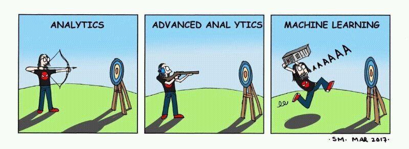

``` {r, echo = FALSE, message = FALSE}

cache <- TRUE

library(dplyr)

```

# Session overview

.largest[

* Introduction

* Data extraction

* Applying the model
  
* Future plans

]

---

# Objectives of this project
.largest[

* Extract data from _medRxiv_ and save in a usable format

* Train and deploy a machine learning model

* Learn some Python <br> (via Google Colab and  `reticulate`)
]

???

`reticulate` is an R package that lets you call Python scripts from R

Google Colabaratory is an online environment - kind of like the Jupyter notebooks we were using earlier in the sessions

---

class: inverse, center, middle

# Introduction

---

# Living systematic reviews

.larger[

An LSR is “<i>a systematic review that is continually updated, incorporating relevant new evidence as it becomes available</i>” <sup>1,2</sup>

Require frequent searches (e.g. monthly) to update evidence base

Possible to set-up search alerts for major evidence sources (e.g. Web of Science, PubMed, Google Scholar)

<br>
Side note: new Cochrane guidance on living reviews (December 2019)
]

.footnote[

<sup>1</sup> <i>Guidance for the production and publication of Cochrane living systematic reviews: Cochrane Reviews in living mode Cochrane.</i> Version: December 2019  
<sup>2</sup> Elliott JH, Synnot A, Turner T, Simmonds M, Akl EA, McDonald S, et al. <i>Living systematic review: 1. Introduction-the why, what, when, and how.</i> Journal of Clinical Epidemiology. 2017;91:23-30.

]

???

My interest in machine learning comes via living systematic reviews

---

# Preprint repositories

.largest[


Key source of new information

Subject specific (e.g. _bioRxiv_,  _PsyArXiv_, _SocArXiv_ )

But, do not allow mass download of citations

<br>
.center[
**How to get the data?**
]
]

???

Preprint repositories allow researchers to upload a non-peer reviewed copy of the manuscript while going through the peer review process

---

class: inverse, center, middle

# Data extraction

---

# _medRxiv_ Overview

``` {r, echo = FALSE, cache = cache}
library(stringr)
library(pushoverr)
library(rvest)

page <- read_html("https://www.medrxiv.org/search/%252A")

results <- page %>%
  html_nodes("#page-title") %>%
  html_text()

results <- as.numeric(word(results))

```

.larger[
_medRxiv_ is the new preprint repository for the medical, clinical, and related health sciences.

<br>
First preprint registered on June 25<sup>th</sup> 2019

<br>
Currently contains `r results` preprints,<sup>*</sup> with approximately ~50 new records uploaded each week
]


.footnote[

<sup>*</sup> This is only _technically_ true. Actually contains more, as often >1 version of the same preprint

]

---

# Introduction to web-scraping

__Definition:__
"_The process of extracting data from a website. . .and copying it to a local database for later retrieval or analysis._" <sup>1</sup>

<br>
__Two key stages:__
* Fetch the webpage (i.e.download a local copy)
* Extract data from it

<br>
__Two key tools:__
* `rvest`: an R package design to facilitate web-scraping by providing functions to achieve the steps above
* _Selector Gadget_: Goolge Chrome plugin that helps to identify the part of the page you wish to scrape 

.footnote[
<sup>1</sup> https://en.wikipedia.org/wiki/Web_scraping
]

---

class: center, middle


.largest[Web-scraping demonstration using <br> `rvest` and _Selector Gadget_]

---

# Look out - `robots(.txt)`! 

Defines the _paths_ within a website that can be scraped, for example:
.center[
<font color="grey">www.riskofbias.info</font>__/welcome/rob-2-0-tool/__
]

--

<br>

The robots.txt file for _medRxiv_ contains the following:
<hr>
.pull-left[
_User-agent: *_  
.  
.  
_Crawl-delay: 10_  
.  
.  
_Disallow: /user/register/_  
_Disallow: /user/password/_  
_Disallow: /user/login/_  
_Disallow: /user/logout/_  
_Disallow: /search/_  
]

.pull-right[
Any web-scraping software  

<br>
Waiting period between requests
<br>
<br>
<br>
<br>
<br>
<br>
<br>
__Do not allow scraping of the search page__
]

<hr>

---

# Look out - `robots(.txt)`! 

.center[
.largest[**Problem:** <br> Can't scrape *search/* page, so can't perform a search and download the results]

]

--

<br>

.center[
.largest[**Solution:** <br> Create an offline copy of the *entire repository* and search it myself (if needed)]
]

???

Prevents common use of databases for systematic reviews

---

# Downloading the repository

.larger[
Two R scripts:
  1. Systematically goes through the /archive path and extracts the links to each individual preprint <br>
  
  1. Uses the list of links created download key information for each preprint:
    * Title 
    * Abstract
    * First author
    * Subject category (Allergy/Pain/Public Health/Epi/etc)
    * Link to bibtex citation
    * Link to PDF
    * Copy of PDF
]  
    
???
 
Program a set delay between scraps of 10 seconds

Rather than the search/ page, use the archive/, which contains all the preprints listed on _medRxiv_ in reverse chronological order.   

---

# Automating the process

.largest[
Process runs every morning at 8am

New data is added to a master spreadsheet (.CSV)

Quality control practices in place
]

???

And just because I am total nerd, a notification is sent to my phone

---

class: center, middle
 
``` {r, echo = FALSE, out.width = '40%', out.height = '40%'}

knitr::include_graphics("figs/screenshot.jpg")

```

---

class:larger

# Potential projects using the _medRxiv_ data

.larger[

* Examine conflicts of interest data

]

--

.larger[

* Examine "availability of data" statements

]

--


.larger[

* **Screen new preprint abstracts using a ML model**

]

---

class: inverse, center, middle

# Machine learning model to classify new preprint abstracts

---

# Original dataset

Systematic review of link between blood lipid levels (e.g. total cholesterol) and subsequent risk of dementia

Initial search of several databases:
  * Medline  
  * EMBASE  
  * Psychinfo  
  * Cochrane Central Register of Controlled Trials (CENTRAL)  
  * Web of Science Core Collection  

__16109__ titles and abstracts screened for inclusion, of which *412* moved to full text screening

<br>

.largest[
**Plan: to use these to train a model to assess the eligibility of new records from _medRxiv_**
]


---

# Data preprocessing

### Expected format

The model expects the both training and testing data in a specific format:
* Unique ID
* Label 
* Alpha
* Text

The text field is created from the: Title + Abstract + Keywords

``` {r, echo = FALSE}

data <- read.csv("../BinaryBert/all-export.csv", header = TRUE, stringsAsFactors = FALSE)

data <- as.data.frame(data[182,c(2,4)])

colnames(data)[1] <- "Record ID"
colnames(data)[2] <- "Text"

data$Label <- 0
data$Alpha <- "a"

data <- data[,c(1,3,4,2)]

kableExtra::kable(data, row.names = FALSE) %>%
  kableExtra::kable_styling(font_size = 12)

```

???

alpha: A column of the same letter for all rows. Not used in classification but still needed.

---

# Data preprocessing

### Creating chunks

Abstracts >200 characters in length split into 2 even halves and indicator column created:

``` {r, echo = FALSE}

data <- read.csv("../BinaryBert/all-export.csv", header = TRUE)

data <- data[2:4]


colnames(data)[1] <- "Record ID"
colnames(data)[2] <- "Chunk ID"
colnames(data)[3] <- "Chunk text"
data$Label <- 0
data$Alpha <- "a"

data <- data[,c(1,4,5,2,3)]

kableExtra::kable(data[c(263:264),], row.names = FALSE) %>%
  kableExtra::kable_styling(font_size = 11)

```


---

# Undersampling of training data

.larger[
16000 records, of which only ~400 are included (label = 1)

Problematic - model will just learn to mark everything as exclude

Solution is to under-sample training data (1 in 20) to create a more balanced dataset

]

---

# Methods

Development dataset (16109 records) was split into training (85%) and test (15%) datasets

Training dataset was then under-sampled:
* All eligible records included
* Ineligible records were included at a rate of 1/20

---

# Methods

Development dataset (16109 records) was split into training (85%) and test (15%) datasets

Training dataset was then under-sampled:
* All eligible records included
* Ineligible records were included at a rate of 1/20

Model: XLNet<sup>1</sup> via `transformers` <sup>2</sup>

.footnote[
<sup>1</sup> Yang Z, Dai Z, Yang Y, Carbonell J, Salakhutdinov R, Le QV. XLNet: Generalized Autoregressive Pretraining for Language Understanding. arXiv preprint arXiv:1906.08237. 2019 Jun 19.  
<sup>2</sup> [https://huggingface.co/transformers/index.html](https://huggingface.co/transformers/index.html)
]

???

And if you Google XLnet, one of the first images that comes up is:

---


class: center, middle

``` {r, echo = FALSE}


```

---

# Methods

Development dataset (16109 records) was split into training (85%) and test (15%) datasets

Training dataset was then under-sampled:
* All eligible records included
* Ineligible records were included at a rate of 1/20

Model: XLNet<sup>1</sup> via `transformers` <sup>2</sup>

Fine tuning parameters:
  * Epochs: 3
  * Batch size: 8
  * Learning rate: 2e-5 (medium to low)
  * Warm-up steps: 50

.footnote[
<sup>1</sup> Yang Z, Dai Z, Yang Y, Carbonell J, Salakhutdinov R, Le QV. XLNet: Generalized Autoregressive Pretraining for Language Understanding. arXiv preprint arXiv:1906.08237. 2019 Jun 19.  
<sup>2</sup> [https://huggingface.co/transformers/index.html](https://huggingface.co/transformers/index.html)
]

???

epoch. A term that is often used in the context of machine learning. An epoch is one complete presentation of the data set to be learned to a learning machine.

Batch size is a term used in machine learning and refers to the number of training examples utilized in one iteration.

---

# Training results

.larger[

Best model results, when assessed using test data (15% of original):

* Sensitivity: 89%
* Specificity: 91%

<br>

**Next step: apply this model to the new dataset of 1043 preprint records from _medRxiv_**

]

---

# Cleaning the predictions

### Chunk predictions

``` {r, echo = FALSE}

data <- read.csv("../BinaryBert/all-export.csv", header = TRUE, stringsAsFactors = FALSE)

data <- data[2:5]

colnames(data)[1] <- "Record ID"
colnames(data)[2] <- "Chunk ID"
colnames(data)[3] <- "Chunk text"
colnames(data)[4] <- "Chunk prediction"

kableExtra::kable(data[c(263:264,267:269),], row.names = FALSE) %>%
  kableExtra::kable_styling(font_size = 8)

```

---

# Cleaning the predictions

### Record predictions

``` {r, echo = FALSE}

data <- read.csv("../BinaryBert/all-export.csv", header = TRUE, stringsAsFactors = FALSE)

data <- data[2:6]

colnames(data)[1] <- "Record ID"
colnames(data)[2] <- "Chunk ID"
colnames(data)[3] <- "Chunk text"
colnames(data)[4] <- "Chunk prediction"
colnames(data)[5] <- "Record prediction"

kableExtra::kable(data[c(263:264,267:269),], row.names = FALSE) %>%
  kableExtra::kable_styling(font_size = 8)

```

???

Rule to combine chunk predictions

---

# Cleaning the predictions

### Final predictions

``` {r, echo = FALSE}

data <- read.csv("../BinaryBert/finalpredictions_CLEAN.csv", header = TRUE, stringsAsFactors = FALSE)

data <- data[,c(2,3,6,7)]

colnames(data)[1] <- "Record ID"
colnames(data)[2] <- "Title"
colnames(data)[3] <- "Prediction"
colnames(data)[4] <- "Prediction score"

kableExtra::kable(data[c(132,14,228, 42, 900, 112, 555),], row.names = FALSE) %>%
  kableExtra::kable_styling(font_size = 11)

```

---

# Results

.larger[

Best model results, when assessed using test data (15% of original):

* Sensitivity: 89%
* Specificity: 91%

]

--

<br>

.larger[
When applied to the new data (1043 records from medRxiv):

* 66 marked as included
* 977 marked as excluded
]

--

<br>

.larger[

A review of the studies marked as "included" found <font color = "red">__2 eligible studies__</font>

]


???


Model performance leads to large number of false positives, but small number of false negatives. 

Preferable in this case, as accept the trade off of having to screen extra false positives for reduced chance of excluding eligible record.

But 66 records marked as included all were at least someway relevant.

---

class: inverse, center, middle

# Discussion

---

# Limitations of methods
.larger[


No additional preprocessing (e.g. convert all numbers to @)

Simplistic rule to combine chunk predictions into record predictions

Different data fields
* Formal databases have keywords (e.g. Dementia/Lipids/HDL)
* _medRxiv_ only has topic area (e.g. Epidemiology)

Only screened those included by the model - PPV only
]

---

# Comments on machine learning

.largest[
* Accessible?
  * Code
  * Hardware

* Reproducible?

* Informative/useful?
]

???

Code was relatively straightforward, but arguably too easy to apply. Similar argument for MR-Base, that the technology makes it too easy for people to do bad MR studies.

Need better hardware - I like Google products, but Colab made me want to scream.

Same model and fine tuning parameters lead to sensitivity varying between 70% and 92%, and a similar spread for specificity.

By the time you train the model, could have screened the records - which you have to do anyway, as even the best model didn't do very well.

---


class: center, middle

``` {r, echo = FALSE}



```

---

# Future plans

.larger[
Add some preprocessing steps to try and improve the performance of my model

Attempt to set up automatic searching/download for other databases

Set-up Rmarkdown template to allow rapid analysis of evidence

  * Table of characteristics
  * metafor::reporter()
  * robvis::summary()

]

---

class: center, middle, inverse

# With (many, many, many)<br> thanks  to  Lena Schmidt
