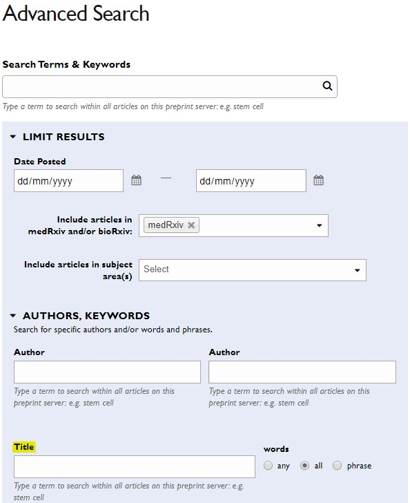
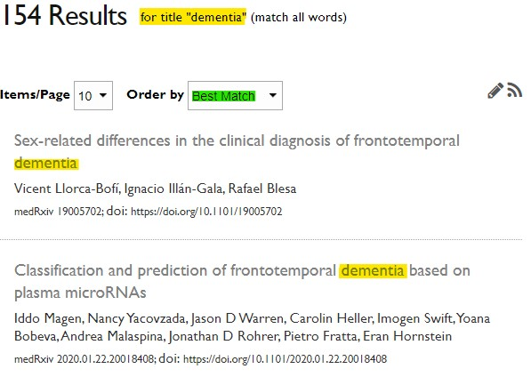
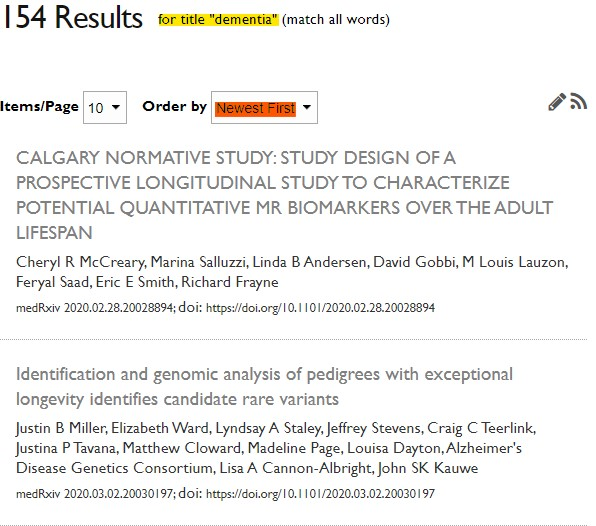

``` {r, echo = FALSE, message = FALSE}
library(medrxivr)

cache <- TRUE

library(dplyr)

```

# Session overview

.largest[

* Motivation

* Getting the data

* Using the tool

* Future plans
  
* Feedback/feature suggestion

]

---

# Objectives of this project
.largest[

* Extract data from _medRxiv_ and save in a useful format

* Provide tool to search for and extract metadata on preprints

* Provide tool to automatically download preprint PDFs
]

???

---

class: inverse, center, middle

# Motivation

---

# Preprint repositories

.largest[

Venue to deposit __preprints__ (non-peer reviewed versions of articles)

Key source of grey literature

Subject specific (e.g. _bioRxiv_,  _PsyArXiv_, _SocArXiv_, __*medRxiv*__)

]

???

Preprint repositories allow researchers to upload a non-peer reviewed copy of the manuscript while going through the peer review process

---

# _medRxiv_ overview

``` {r, echo = FALSE, cache = cache, warnings = FALSE, message = FALSE}
library(stringr)
library(pushoverr)
library(rvest)

page <- read_html("https://www.medrxiv.org/search/%252A")

results <- page %>%
  html_nodes("#page-title") %>%
  html_text()

results <- gsub(",","", results)

results <- as.numeric(word(results))

```

.larger[
_medRxiv_ is the new preprint repository for the medical, clinical, and related health sciences.

<br>
First preprint registered on June 25<sup>th</sup> 2019

<br>
Currently contains `r results` preprints,<sup>*</sup> with approximately ~100 new records uploaded each week

<br>
__BUT__ two major obstacles to usefulness as a grey literature source for systematic reviews

]

.footnote[

<sup>*</sup> This is only _technically_ true. Actually contains more, as often >1 version of the same preprint

]

---


## Major issues #1: Searching

--

.larger[
.center[

<br>
<br>
<br>
# The medRxiv search is <br> <u>not fit for purpose</u>
]
]

---

class: center, middle
 
``` {r, echo = FALSE, out.width = '65%', out.height = '65%'}



```

---

class: center, middle
 
``` {r, echo = FALSE, out.width = '100%', out.height = '100%'}



```

---

class: center, middle
 
``` {r, echo = FALSE, out.width = '100%', out.height = '80%'}



```

---

#### CALGARY NORMATIVE STUDY: STUDY DESIGN OF A PROSPECTIVE LONGITUDINAL STUDY TO CHARACTERIZE POTENTIAL QUANTITATIVE MR BIOMARKERS OVER THE ADULT LIFESPAN

Introduction: A number of magnetic resonance (MR) imaging methods have been proposed to be useful, quantitative biomarkers of neurodegeneration in aging. The Calgary Normative Study (CNS) is an ongoing single-centre, prospective, longitudinal study that seeks to develop, test and assess quantitative MR methods as potential biomarkers. The CNS has three objectives: first and foremost, to evaluate and characterize the dependence of the selected quantitative neuroimaging biomarkers on age over the adult lifespan; secondly, to evaluate the precision, variability and repeatability of quantitative neuroimaging biomarkers as part of biomarker validation providing proof of-concept and proof-of-principle; and thirdly, provide a shared repository of normative data for comparison to various disease cohorts. Methods and Analysis: Quantitative MR mapping of the brain including longitudinal relaxation time (T1), transverse relaxation time (T2), T2*, magnetic susceptibility (QSM), diffusion and perfusion measurements, as well as morphological assessments are performed. The Montreal Cognitive Assessment (MoCA) and a brief, self-report medical history will be collected. Mixed regression models will be used to characterize changes in quantitative MR biomarker measures over the adult lifespan. In this report on study design, we report interim prevalence and demographic information of recruitment from 28 May 2013 to 31 December 2018. Ethics and Dissemination: Participants provide signed informed consent. Changes in quantitative MR biomarkers measured over the adult lifespan as well as estimates of measurement variance and repeatability will be disseminated through peer-reviewed scientific publication.

---

## Major issues #1: Searching


.largest[

* Unclear how search works - problematic for search reproducibility

* Not possible to use complex queries <br> (e.g. "randomi*ation")

* Not possible to use Boolean combinations to build search (AND, OR, NOT)
]


---

## Major issues #2:  Downloading

.largest[
* Not possible to "bulk" download either:
  * Metadata for title/abstract screening
  * PDFs for full text screening

<br>

* __Inefficient for systematic reviewers__
]

---

.largest[
.center[

<br>
# Solution?

# Build a new tool that overcomes these issues: <br> _medrxivr_
]
]

---

class: inverse, center, middle

# Getting the data

---

# Introduction to web-scraping

__Definition:__
"_The process of extracting data from a website. . .and copying it to a local database for later retrieval or analysis._" <sup>1</sup>

<br>
__Two key stages:__
* Fetch the webpage (i.e.download a local copy)
* Extract data from it

<br>
__Two key tools:__
* `rvest`: an R package design to facilitate web-scraping by providing functions to achieve the steps above
* _Selector Gadget_: Google Chrome plugin that helps to identify the part of the page you wish to scrape 

.footnote[
<sup>1</sup> https://en.wikipedia.org/wiki/Web_scraping
]

---

# Downloading the repository

.larger[
Two R scripts:
  1. Systematically goes through the site and extracts the links to each individual preprint <br>
  
  1. Uses the list of links created download key information for each preprint:
    * Title 
    * Abstract
    * First author
    * Subject category (Allergy/Pain/Public Health/Epi/etc)
    * Link to bibtex citation
    * Link to PDF
]  
    
???
 
Program a set delay between scraps of 10 seconds

Rather than the search/ page, use the archive/, which contains all the preprints listed on _medRxiv_ in reverse chronological order.   

---

# Automating the process

.largest[
Process runs every morning at 9am

New data is added to a master dataset

Quality control practices in place
* Ensures all records captured
* Ensures record completeness 
]

???

And just because I am total nerd, a notification is sent to my phone

---

class: center, middle
 
``` {r, echo = FALSE, out.width = '40%', out.height = '40%'}


```


---

class: inverse, center, middle

# Using the tool

[1](https://mcguinlu.shinyapps.io/medrxivr/) / 
[2](https://gist.github.com/mcguinlu/81e5eeeea2904930ce36700ed40de00e)

---

class: inverse, center, middle

# Discussion

---

class:larger

# Potential uses of _medrxivr_
.largest[

* Easily (/automatically?) download preprint abstracts/PDFs related to your review

]

--

.largest[

* Examine conflicts of interest data

]

--

.largest[

* Examine "availability of data" statements

]

--

.largest[

* [Explore preprint publishing trends](https://lbrierley.github.io/cov_preprints/medrxiv_cov_preprints.html)

]

---

# Future plans

.largest[

Three main areas for improvement:

* Improve data scraping (e.g. author field)

* Expand search to include subject field

* Allow users to specify search field(s)

]

---

# Future plans

.largest[

Dissemination

* Freely available via Github & Shiny

* Started rOpenSci process 
  * Open-source code peer review 
  * Results in article in JOSS

* Shared on Twitter

]

---

class: center, middle, inverse

# With (many!)<br> thanks  to  Lena Schmidt<br> <br>Questions/comments/ suggestions?  

