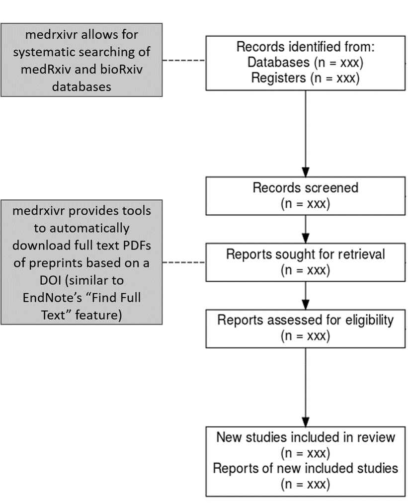
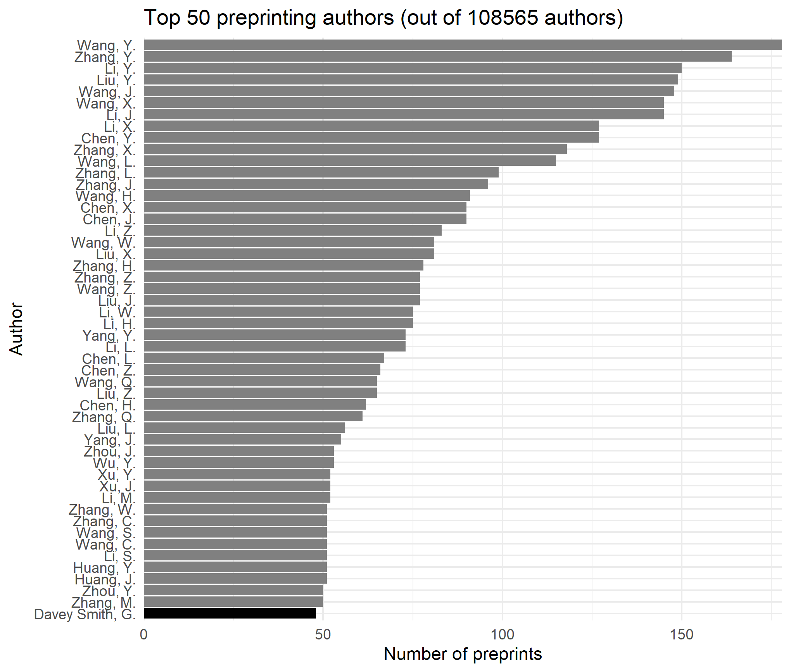

``` {r, echo = FALSE, message = FALSE}
library(medrxivr)

cache <- TRUE

library(dplyr)


xaringanExtra::use_xaringan_extra(c("tile_view", "webcam", "scribble"))


xaringanExtra::use_logo(
  image_url = "https://raw.githubusercontent.com/ropensci/medrxivr/master/man/figures/hex-medrxivr.png",
  link_url = "https://github.com/ropensci/medrxivr",
  position = xaringanExtra::css_position(top = "1em", right = "1em")
)

```

# Overview

.larger[

* Motivation for this project
  * Why include preprints in systematic reviews?
  * Problems with native medRxiv search

* Introducing `medrxivr`
  * Run a simple search
  * Advanced functions

* Discussion
  * Use cases
  * Common criticisms (& rebuttals)
  * Feedback/feature suggestion

]

---

class: inverse, center, middle

# Motivation

---

## Preprints in systematic reviews

.larger[
Systematic reviews seek to identify all evidence on a particular research question

<br>

Preprints are non-peer reviewed versions of manuscripts

* Provide a glimpse into the future

* Potentially less susceptible to publication bias 

<br>

Preprints should be considered an important source of information for systematic reviews
]

???

Preprint repositories allow researchers to upload a non-peer reviewed copy of the manuscript while going through the peer review process

---

## _medRxiv_ overview

``` {r, echo = FALSE, cache = cache, warnings = FALSE, message = FALSE}
library(stringr)
library(rvest)
library(medrxivr)

results <- mx_snapshot() %>%
  group_by(doi) %>%
  summarise(number = n()) %>%
  nrow()

```

.larger[
_medRxiv_ is the preprint repository for the medical, clinical, and related health sciences.<sup>1</sup>

<br>

.center[
``` {r, echo = FALSE, out.width = '50%', out.height = '30%'}


```
]

<br>

__BUT two major problems limit its usefulness in systematic reviews__

]

<hr>
<sup>1</sup> Rawlinson C, Bloom T. New preprint server for medical research. BMJ. 2019;365. doi:10.1136/bmj.l2301

???
Replaces "Clinical Trial"/"Epidemiology" categories on _bioRxiv_
First preprint registered on June 25<sup>th</sup> 2019 - currently contains `r results` preprints

---

## Problem #1: Systematic searching

--

.larger[
.center[

<br>
<br>
<br>
# The medRxiv native search is <br> <u>not fit for use in systematic reviews</u>
]
]

---

## Problem #1: Systematic searching


.larger[

Can't build complex searches (multiple topics)

<br>

Boolean operators (_AND, OR, NOT_) don't work as expected]

* "dementia AND (lipids OR statins)" = 199 results
* "dementia AND (statins OR lipids)" =  77 results

<br>

.larger[
Search is poorly documented and subject to change (problematic for search reproducibility)
]

.center[
``` {r, echo = FALSE, out.width = '60%', out.height = '30%'}


```
]

<br>

???

Some hidden weighting of terms means there is great variability in results obtained

Should be noted that we aren't actually sure Boolean operators work on the site.

---

## Problem #2: Extracting metadata

.larger[
Not possible to "bulk" download either:
* Metadata for title/abstract screening
* PDFs for full text screening]

<br>
.center[
``` {r, echo = FALSE, out.width = '80%', out.height = '30%'}


```
]

<br>
.larger[
__Incredibly ineffecient (and frustrating!)__
]

---

class: inverse, center, middle

# Introducing `medrxivr`

---

## Where it can help

.center[
``` {r, echo = FALSE, out.width = '50%', out.height = '50%'}



```
]
---

## Works in three steps
.largest[

1 - Import the data

<br>

2 - Create your search strategy

<br>

3 - Perform the search
]

---

## Import data

From the live API:

``` {r, eval = FALSE}
mx_data <- mx_api_content()
```

From the maintained snapshot (faster/more reliable):

``` {r, message = FALSE}
mx_data <- mx_snapshot()
```

<hr>
 
Resulting data contains several useful variables:

```{r, include = FALSE}
mx_data <- tibble::as.tibble(mx_data)
```

``` {r}
colnames(mx_data)
```

---

<br>

``` {r, echo = FALSE, out.width = '90%', out.height = '90%'}



```

---

## Create a search strategy

Search terms are combined in a vector using __*OR*__

Multiple topics are combined in a list with __*AND*__

<br>

```{r}
topic1  <- c("dementia","vascular","alzheimer's") # Combined w/ OR
topic2  <- c("lipids","statins","cholesterol")    # Combined w/ OR

myquery <- list(topic1, topic2)                   # Combined w/ AND
```

No limit on number of topics that can be included

<br>
<hr>

.larger[__Advanced syntax__]

Wildcards (*) and proximity operators (NEAR#) are also supported

E.g. "randomi*ation" will find "randomi__z__ation" and randomi__s__ation"

---

## Perform the search

```{r}
mx_results <- mx_search(data = mx_data,
                        query = myquery,
                        report = TRUE)
```

---

## Additional functions

### Exporting to .bib file

Allows for easy import into reference manager

```{r, eval= FALSE}
mx_export(data = mx_results,
          file = "mx_search_results.bib")
```

<br>

### Download PDFs of included records

Similar to EndNote "Find Full Text"

```{r, eval = FALSE}
mx_download(mx_results, # Object returned by mx_search()
            "pdf/")     # Directory to save PDFs to
```
---

class: inverse, center, middle

# Discussion

---

## Use cases for _medrxivr_ 
.larger[

Include medRxiv/bioRxiv as a evidence source in "living" systematic reviews (programmatically run the search every day)

]

--

<br>

.larger[

Perform preprinted-published concordance meta-studies (e.g. reporting quality, impact of peer review)

]

--

<br>

.larger[

[Explore preprint publishing trends](https://lbrierley.github.io/cov_preprints/medrxiv_cov_preprints.html)

]

---

class: larger

## Common criticisms

.larger[_"Quality of preprints is lower than peer reviewed papers"_]

 * Peer-review is not a stamp of quality 
 * Can be handled with good risk-of-bias assessment as part of review

<br>
.larger[_"Results of paper may change following peer-review"_]

 * Meta-study found high concordance between preprints and published papers
 * Best available evidence at time of systematic review
 
<br> 
.larger[_"Results of preprints may change between versions"_]

 * `medrxivr` allows to extract all versions of a preprint and examine changes for yourself

---

## Dissemination

.larger[

Freely available via CRAN (stable) or GitHub (development)

```{r, eval = FALSE}
# From CRAN
install.packages("medrxivr")

# From GitHub
devtools::install_github("ropensci/medrxivr")
```

Extensive documentation available from the package website: [https://docs.ropensci.org/medrxivr/](https://docs.ropensci.org/medrxivr/)

Accepted to rOpenSci, and corresponding paper published in Journal of Open-Source Software [](https://doi.org/10.21105/joss.02651)

<br>

.center[
__Would highly recommend rOpenSci review process__
]
]

---

## Acknowledgements 

.larger[

Many (__*many!*__) thanks to Lena Schmidt for co-development work.

<br>

Thanks to Tuija Sonkkila and Najko Jahn for reviewing the package as part of the rOpenSci review process and providing useful feedback.

<br>

Thanks to members of the Bristol Appraisal and Review of Research (BARR) team for piloting.

]

---

class: inverse, center

<br>
<br>
<br>
<br>
<br>
<br>
<br>
<br>
<br>

## Questions/comments/suggestions?

#### Twitter: [@mcguinlu](https://twitter.com/mcguinlu) | GitHub: [@mcguinlu](https://github.com/mcguinlu)
