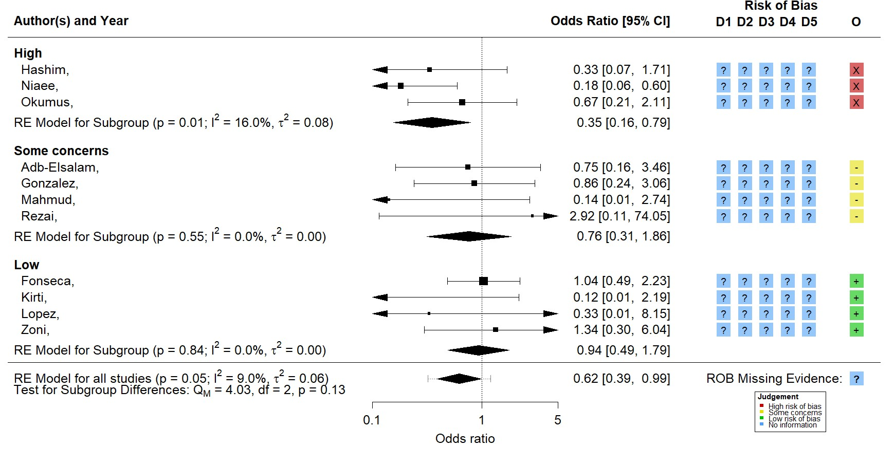
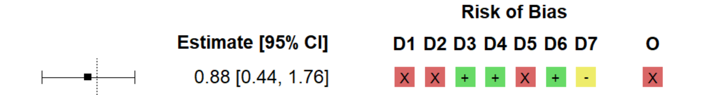
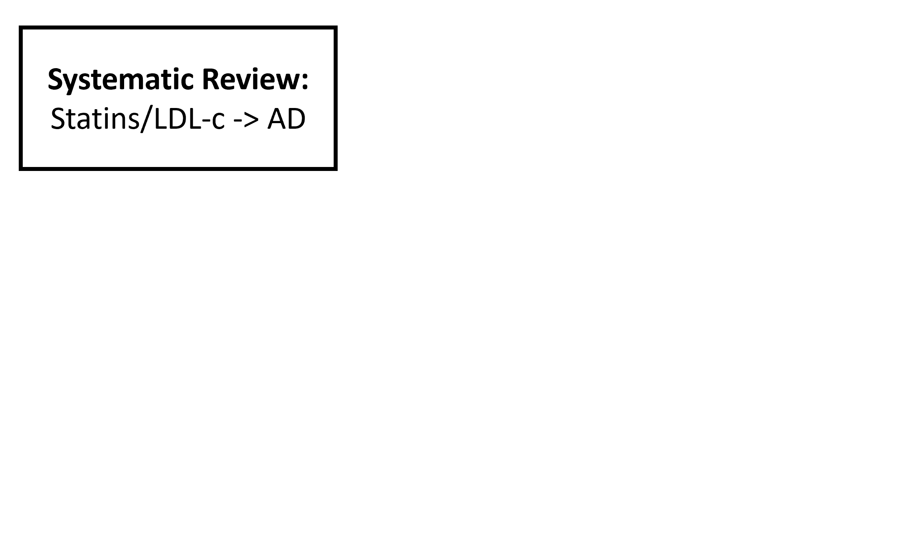
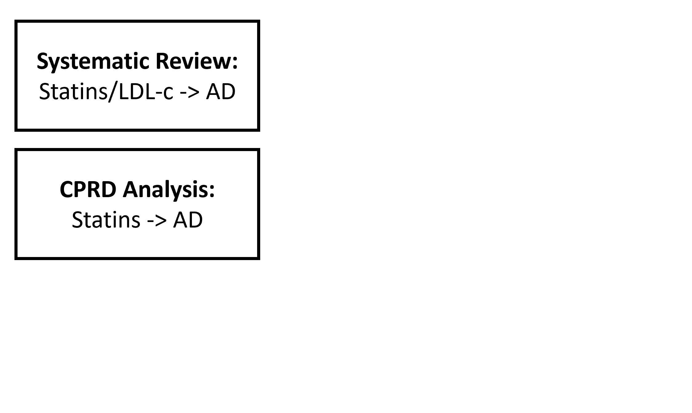
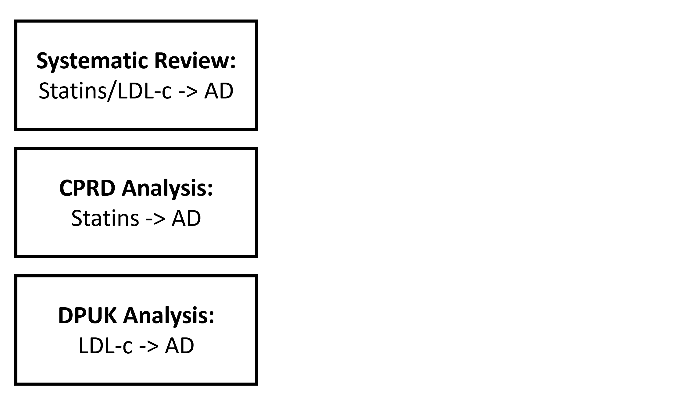
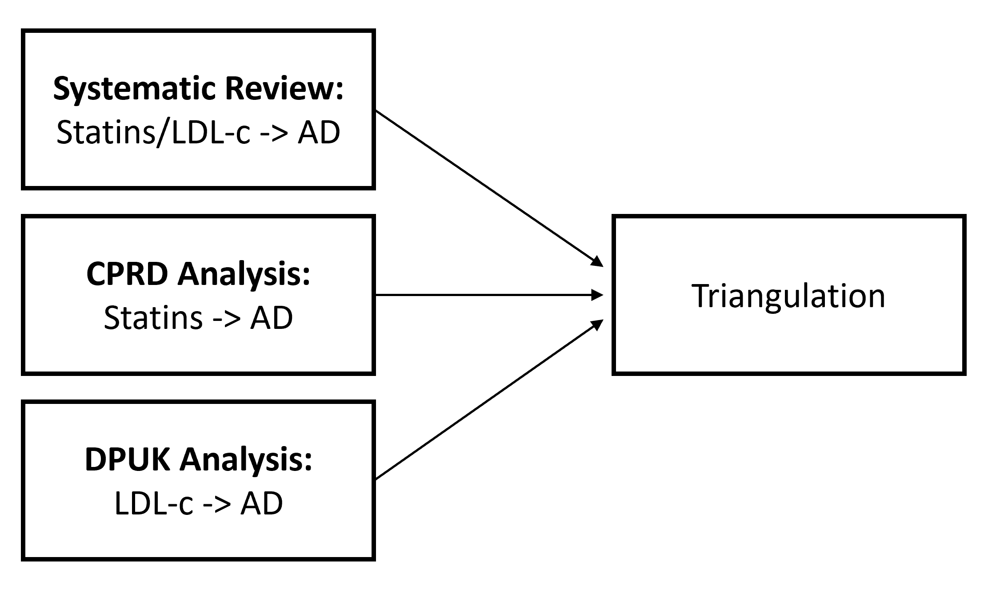
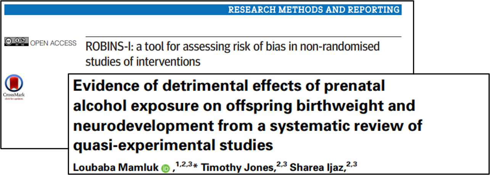
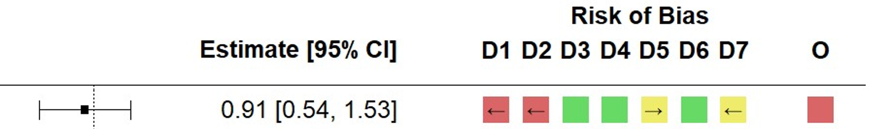
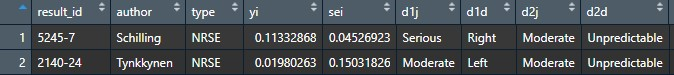

``` {r, echo = FALSE, message = FALSE, warning = F}

knitr::opts_chunk$set(warning = F, message = F, echo = F)
knitr::opts_chunk$set(fig.height = 8, out.width = "100%", comment = " ", cache = F, dpi = 700)

library(dplyr)

xaringanExtra::use_xaringan_extra(c("tile_view", "webcam", "scribble"))

```


```{r, include=FALSE}
htmltools::includeCSS("https://raw.githubusercontent.com/malcolmbarrett/kakashi/master/kakashi.css")
```

class: largest

## Overview

--

Overview of risk-of-bias assessment ✔️❔❌

--

Proposed method for quantitative triangulation 🔺

--

Assumptions/Limitations ✋

--

Takeaways/future work 🔭

--

Outputs 📊

---

class: largest

## Acknowledgements

__Supervisors:__ Julian Higgins, Yoav Ben-Shlomo, Liz Coulthard, George Davey-Smith

<br>

__Triangulation discussion panel:__ Deborah Lawlor, Kate Tilling

<br>

__`robvis` contributors:__ Randall Boyes, Andrew Fowler


---

## Developments in risk of bias assessment

.largest[
Move from __check-lists/scales__ to __domain-based tools__
]

--

.largest[
Example: __RoB 2__ tool for randomised controlled trials:
]

.larger[
1. bias arising from the __randomization__ process;
1. bias due to __deviations__ from __intended interventions__;
1. bias due to __missing outcome data__;
1. bias in __measurement of the outcome__;
1. bias in __selection__ of the __reported result__.
]

--

<br>

.center[
.largest[
Increased appreciation that these assessments should be __incorporated into analyses__
]
]

---

## Important to show risk of bias alongside result

```{r, fig.align='center',out.width='90%'}



```

.footer[Hill _et al._ 2021 [10.21203/rs.3.rs-1003006/v1](https://doi.org/10.21203/rs.3.rs-1003006/v1)]

???

Produced using data from Hill et al analysis of 11 trials for ivermectin, an anti-parastic, on COVID-19 survival.

Lot of controversy over effectiveness of intervention

Cover:

* Paired forest plot
* Study and effect estimate on left
* Domains on right are RoB2 - blued out because this data not available
* Even looking at overall only, when stratifying by risk of bias the effect disappears when moving 

Authors had the risk of bias data at the time of inital publication in early 2021
---

class: largest

# Bias adjusted meta-analysis

General method proposed in 2009 (prior to domain-based tools)<sup>1</sup>

.footer[<sup>1</sup> Turner _et al._ 2009 [10.1111%2Fj.1467-985X.2008.00547.x](https://dx.doi.org/10.1111%2Fj.1467-985X.2008.00547.x)]

???

Taking this approach of incorportating bias assessment into your analyses is the idea of bias-adjusted meta-analyses

--

__Adjusted for:__

* internal bias (__validity__)
* external bias (__indirectness__)

???

For indirectness, if your causal question of interest was cumulative lipid-lowering on a disease, you would place more weight on 

--

Used expert elicitation to predict extent and direction of bias

???

Problems - not very systematic

Blinding - reviews were aware of the results of the study when assessing whether it was biased

But core idea, that you can put a prior term on the amount of bias and indirectness and adjust for this in a meta-analyses is interesting

---

class: largest

## .center[Combination of existing methods?]

<br>

.center[

Detailed systematic bias assessment

+

Bias/indirectness-adjusted meta-analysis

=

Quantitative triangulation?
]

???

So 

Outline a proposed method for moving towards quantitative 

---

class: larger

## .center[Triangulation]

__Triangulation__

> The practice of strengthening causal inferences by integrating results from several different approaches, where each approach has different (and assumed to be largely unrelated) key sources of potential bias.<sup>1</sup>

.footer[<sup>1</sup> Lawlor _et al_. 2017 [10.1093/ije/dyw314](https://doi.org/10.1093/ije/dyw314)]

--

<br>

__Implementation to date__

* Predominantly qualitative

???

Like what you would have in the discussion section of a manuscript - comparing the 

--

* Assigned bias at the study-design level

```{r, fig.align='center',out.width='80%'}



```

???

So assuming that all non-randomised studies of interventions have the same direction of effect. 

Results in a loss of information, as masks potentially competing/neutralising biases in specific domains.

This is particularly the case when using the overall summary from a meta-analysis of similar studies - masking not just different within result biases, but different between result biases too.

---

class: largest

## Step 1: Define causal question of interest

(ROBINS-E framework is v. useful for this!)

<br>

__Case study:__ effect of LDL-c on Alzheimer's disease risk

*	_Population of interest_: __General population__
*	_Exposure of interest_: __Low density lipoprotein cholesterol__
*	_Exposure window of interest_: __Midlife (45-60)__
* _Summary measure of exposure over time_: __Average exposure__

???

Need to do this in advance, as this is the question you are trying to answer/triangulate against.

LDL-AD is a useful illustrative example, as has most forms of evidence and greatest number of studies available per evidence type.

Not that this is an illustrative case study, as a proof-of-concept for the method, rather than

This is for problems with the assumptions of the method that will become clear later which limit the interpretability of the results

---

## Step 2: Identify relevant evidence

```{r, fig.align='center',out.width='80%'}



```

???

Systematic review plus primary studies to fill in the gaps/add additional evidence

Review looked at several exposures and outcomes, but focus on LDL-AD here for clarity

---

## Step 2: Identify relevant evidence

```{r, fig.align='center',out.width='80%'}



```

???

Cox proportional hazards model with a time-varying treatment indicator to address the immortal time bias seen in other Non-randomised studies of statins found by the review

---

## Step 2: Identify relevant evidence

```{r, fig.align='center',out.width='80%'}



```

???

Via the Dementia Platform UK, identified 3 cohorts with data on LDL and lipids that had not been previously analysed.

---

## Step 2: Identify relevant evidence

```{r, fig.align='center',out.width='80%'}



```

???

Systematic review plus primary studies to add more evidence/fill in the gaps

---

class: largest

## Step 2: Identify relevant evidence

__Summary of evidence:__

* 12 non-randomised studies of interventions (Statins-AD)
* 5 non-randomised studies of exposures (LDL-AD)
* 1 Mendelian randomisation study (LDL-AD)

???

---

class: largest

## Step 3a: Assess extent and direction of bias

Use domain-based tools to assess bias in __each numerical result__:
.pull-left[
RCT - RobB 2  
NRSI - ROBINS-I  
NRSE - ROBINS-E  
MR - Mamluk _et al._ 2020<sup>1</sup>]

.pull-right[<br>]

.footer[Mamluk _et al._ [10.1093/ije/dyz272](https://doi.org/10.1093/ije/dyz272)]

???

Note that this is distinct from previous efforts at triangulation, which assigned a risk of bias to the study design (e.g. to a meta-analysis of observational studies). Results in a loss of information, as different results within the meta-analysis could be subject to competing sources of bias and this is masked by the study-design-level assignment.

--

```{r, fig.align='center',out.width='80%'}

knitr::include_graphics("figs/bias_direction.jpg")

```

???

Shows domain 2 of RoB 2 - see that 

---

## Step 3b: Visualise the extent and direction of bias

```{r, fig.align='center',out.width='80%'}

knitr::include_graphics("figs/triangulation_example_LDL_AD_no_summ.jpg")

```

???

Cover:

* Stratified by type
* Varying numbers of domains
* Level indicated by colour
* Direction indicated by arrow
* No direction for "Low" risk - green
* Question mark = unpredictable

No overall

This step can help you assess whether all biases are working in opposing or the same direction. 

While this is not as important for the proposed quantitative method, as it is still a useful sense-check

---

class: larger

## Step 4: Define modifying terms (bias and indirectness)

Each level of bias assigned mean + variance 

E.g. high (red) mean = 0.2, moderate (yellow) mean = 0.1 

Sign is determined by predicted direction

```{r, fig.align='center',out.width='80%'}

```

<br>

Adjusted point estimate = 0.91 + 0.2 + 0.2 - 0.1 + 0.1 = 1.31

Variances of each bias are then used to reduce precision of estimate

???
Variance of each bias is used to reduce precision of effect estimate

Similar approach taken for __indirectness (external bias)__

Values assigned to direct and indirect biases summed

Estimate is shifted by this much, and precision of effect estimate reduced

Deciding on values is the most contentious bit and the biggest limation

How do we know these

---

class: largest

## Step 4: Define modifying terms (bias and indirectness)

Modifying terms can be __additive__ or __proportional__


???

Example on previous page is simple one - all additive biases

Additive: shifts effect up/down. Can induce inverse effect

Proportional: changes magnitude of effect

--

Maps to options in risk of bias tools:

```{r, fig.align='center',out.width='80%'}

knitr::include_graphics("figs/bias_direction.jpg")

```

???

Favours comparator/experiment -> additive bias

Towards/ away from null -> proportional bias

--

Apply similar approach to __indirectness__

???

Downweighting less-relevant studies. 

---

class: largest

## Step 5: Preform bias-adjusted meta-analyses

* Calculate bias adjusted estimates for each study

* Combine in a standard random-effects meta-analysis

---

class: largest

## Assumptions

???

I haven't presented results of the bias-adjusted analyses, because it's meant to be a proof-of-concept and there are several limitations to the method which would render the results massively biased.

--

Direction of bias is __predictable__

???

Often not the case

--

Impact of bias is __equal across domains__

???

This is how the RoB tools were original designed, so that "High" risk of bias in one domain was equivalent to "High" in any other.

However, this might not be true

--

Modifying values assigned to bias and indirectness are __accurate__

```{r, fig.align='center',out.width='80%'}


```

???

No good empirical evidence for these terms in non-randomised studies

How should the relationship between them be modelled?

---

class: largest

## Identifying informative priors

Meta-epidemiological studies of __impact of bias__ uncommon for NRS

???

Counter-intuitive as RCTs are less likely to be at high-risk of bias

But low-hanging fruit - standardised reporting

--

Will require careful design for each risk-of-bias domain 

__Example:__ text-mining to compare unadjusted and fully-adjusted results to obtain impact of insufficient control of confounding

---

class: largest

## Takeaways

Triangulation = __extension of evidence synthesis__

???

To my mind, though it disagrees with the majority of existing triangulation examples, triangulation should be viewed as an extension of evidence synthesis

And so evidence synthesis methods should be applied 0 systematic risk of bias assessments

Base triangulation on systematic review - try to fill in gaps with new evidence

--

Predicting __direction of bias__ in domains can be difficult

???

Assessing predicted direction of effect is very difficult with some exceptions (e.g. immortal time bias, non-differential misclassification)

Give example of different effect confounders working against each other

--

Substantial further work needed to define __reasonable priors__ for bias/indirectness terms

???

---

class: largest

## Projects outputs

Generalised tools to:

* produce the bias direction plots (`robvis`)
* perform the bias-adjusted triangulation (`triangulate`)

???

In contrast to previous example-specific code, I've developed a generalised method for conducting these analyses

Allows flexibility in terms of 
* Number of domains of bias (e.g. Risk of bias vs )
* Different prior for each domain

--

<br>

Example dataset for use with future methods

```{r, fig.align='center',out.width='80%'}



```

???

Will enable rapid testing of new methods

<!-- --- -->

<!-- ## Future work: -->

<!-- * Sensitivity analyses exploring the relationships between bias-levels -->
<!-- *  -->

---

class: largest

## Summary

__Proposed method:__
1. Define causal question
1. Identify related evidence
1. Assess (and visualise) extent and direction of bias
1. Define modifying terms for bias and indirectness ⚠️
1. Perform bias-adjusted meta-analysis
