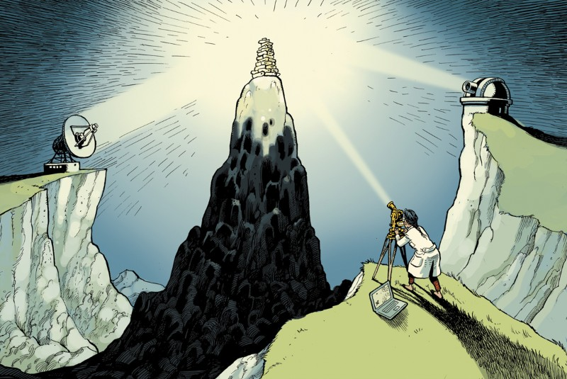

``` {r, echo = FALSE, message = FALSE, warning = F}

knitr::opts_chunk$set(warning = F, message = F, echo = F)
knitr::opts_chunk$set(fig.height = 8, out.width = "100%", comment = " ", cache = F, dpi = 700)

library(dplyr)

xaringanExtra::use_xaringan_extra(c("tile_view", "webcam", "scribble"))

```


```{r, include=FALSE}
htmltools::includeCSS("https://raw.githubusercontent.com/malcolmbarrett/kakashi/master/kakashi.css")
```

class: largest

## Overview


Evidence synthesis in healthcare research 🏥

Problem statement ⚠

Incorporating risk-of-bias assessments into analyses ✔️❔❌

Triangulating across study designs 🔺

Limitations ✋

Takeaways 🔭

---

class: largest

## Evidence synthesis in healthcare research

<br>

Systematic reviews (with/without meta-analysis) considered gold standard in health care research

<br>

```{r, fig.align='center',out.width='110%'}


```

.footer[https://kib.ki.se/en/search-evaluate/systematic-reviews]

???

Going to focus on two areas:
- Critical assessment/appraisals
- Synthesis of results

---

class: largest

## Evidence synthesis in healthcare research

<br>

Systematic reviews (with/without meta-analysis) considered gold standard in health care research

<br>

```{r, fig.align='center',out.width='110%'}


```

.footer[https://kib.ki.se/en/search-evaluate/systematic-reviews]


---

class: largest

## Critical assessment/appraisal tools

E.g. ROB 2 for randomised controlled trials:

.larger[
1. bias arising from the __randomization__ process;
1. bias due to __deviations__ from __intended interventions__;
1. bias due to __missing outcome data__;
1. bias in __measurement of the outcome__;
1. bias in __selection__ of the __reported result__.
]

--

```{r, fig.align='center',out.width='70%'}


```

---

## Meta-analysis (via forest plot)


```{r, fig.align='center',out.width='70%'}


```

.footer[Using data from a review on the effectiveness of the BCG vaccine for the prevention of tuberculosis. [10.1001/jama.1994.03510330076038](https://doi.org/10.1001/jama.1994.03510330076038)]

???

Meta-analysis

---

class: largest

## Problem statement

Risk of bias data is __under-utilized__ in systematic reviews

<br>

```{r, fig.align='center',out.width='100%'}

knitr::include_graphics("figs/bias_papers2.png")
```

???

Even when performed, the results are not used

---

class: largest

## Problem statement

Increased appreciation that __results of bias assessment__ should be __incorporated into meta-analyses__

???

All agree that there is a need to do better

Bigger question is how?

--

<br>

Two approaches suggested:

* __Stratification__ (straightforward 🥳)
* __Bias-adjusted meta-analysis__ (more complex 😟)


---

## Simple: Stratify meta-analyses by risk of bias

```{r, fig.align='center',out.width='80%'}


```

.footer[Using data from a review of ivermectin for COVID-19. Hill _et al._ 2021 [10.21203/rs.3.rs-1003006/v1](https://doi.org/10.21203/rs.3.rs-1003006/v1)]

???

Produced using data from Hill et al analysis of 11 trials for ivermectin, an anti-parastic, on COVID-19 survival.

Lot of controversy over effectiveness of intervention

Cover:

* Paired forest plot
* Study and effect estimate on left
* Domains on right are RoB2 - blued out because this data not available
* Even looking at overall only, when stratifying by risk of bias the effect disappears when moving 

Authors had the risk of bias data at the time of initial publication in early 2021

---

class: largest

# More complex: Bias-adjusted analyes

General method proposed in 2009<sup>1</sup>

.footer[<sup>1</sup> Turner _et al._ 2009 [10.1111%2Fj.1467-985X.2008.00547.x](https://dx.doi.org/10.1111%2Fj.1467-985X.2008.00547.x)]

???

Taking this approach of incorportating bias assessment into your analyses is the idea of bias-adjusted meta-analyses

--

__Adjusted for:__

* internal bias (__validity__)
* external bias (__indirectness__)

???

For indirectness, if your causal question of interest was cumulative lipid-lowering on a disease, you would place more weight on studies that closely resembled this

--

Used expert elicitation to predict extent and direction of bias in each result

???

Problems - not very systematic

Blinding - reviews were aware of the results of the study when assessing whether it was biased

But core idea, that you can put a prior term on the amount of bias and indirectness and adjust for this in a meta-analyses is interesting

---

class: largest

# More complex: Bias-adjusted analyes

General method proposed in 2009<sup>1</sup>

.footer[<sup>1</sup> Turner _et al._ 2009 [10.1111%2Fj.1467-985X.2008.00547.x](https://dx.doi.org/10.1111%2Fj.1467-985X.2008.00547.x)]

__Adjusted for:__

* .red[internal bias (__validity__)]
* .grey[external bias (__indirectness__)]


Used expert elicitation to predict extent and direction of bias in each result

---

class: largest

## .center[Combination of existing methods?]

<br>

.center[

Detailed systematic bias assessment

+

Bias-adjusted meta-analysis

=

Triangulation?
]

???

So 

Outline a proposed method for moving towards quantitative 

---

class: largest

## .center[Triangulation]

.left-column[.center[Or <br><br><br> __"How I learned to stop worrying and love the ambiguity"__]]

```{r, fig.align='center',out.width='70%'}



```


.footer[Lawlor _et al_. 2017 [10.1093/ije/dyw314](https://doi.org/10.1093/ije/dyw314) / https://www.nature.com/articles/d41586-018-01023-3]

???

__Triangulation has been a goal in epidemiology for a while:__

> The practice of strengthening causal inferences by integrating results from several different approaches, where each approach has different (and assumed to be largely unrelated) key sources of potential bias.<sup>1</sup>

__Implementation to date has been predominantly qualitative (think Discussion section of an academic manuscript)

Like what you would have in the discussion section of a manuscript - comparing the 

So assuming that all non-randomised studies of interventions have the same direction of effect. 

Results in a loss of information, as masks potentially competing/neutralising biases in specific domains.

This is particularly the case when using the overall summary from a meta-analysis of similar studies - masking not just different within result biases, but different between result biases too.

---

class: largest

## Step 1: Define causal question of interest

__Case study:__ effect of LDL-c ("bad cholesterol") on Alzheimer's disease risk

*	_Population of interest_: __General population__
*	_Exposure of interest_: __Cholesterol__
*	_Exposure window of interest_: __Midlife (45-60)__
* _Summary measure of exposure over time_: __Average exposure__

???

Need to do this in advance, as this is the question you are trying to answer/triangulate against.

LDL-AD is a useful illustrative example, as has most forms of evidence and greatest number of studies available per evidence type.

Not that this is an illustrative case study, as a proof-of-concept for the method, rather than

This is for problems with the assumptions of the method that will become clear later which limit the interpretability of the results

---

class: largest

## Step 2: Identify relevant results

```{r, fig.align='center',out.width='90%'}


```

???

Relevant evidence sourced from systematic review

---

class: largest

## Step 3a: Assess extent and direction of bias

Use domain-based tools to assess bias in __each numerical result__

<br>

Assess both **extent** and **direction** of bias

```{r, fig.align='center',out.width='80%'}


```

???

Shows domain 2 of RoB 2 - see that 

---

## Step 3b: Visualise the extent and direction of bias

```{r, fig.align='center',out.width='80%'}


```

???

Cover:

* Stratified by type
* Varying numbers of domains
* Level indicated by colour
* Direction indicated by arrow
* No direction for "Low" risk - green
* Question mark = unpredictable

No overall

This step can help you assess whether all biases are working in opposing or the same direction. 

While this is not as important for the proposed quantitative method, as it is still a useful sense-check

---

class: larger

## Step 4a: Define modifying terms (bias)

Each level of bias (high, moderate, low) gets a distribution:

.center[
| **Bias level** | **Modifying distributions** |
|----------------|-----------------------------|
| Low            |              -              |
| Moderate       |         N(0.1, 0.05)        |
| High           |         N(0.2, 0.09)        |
]


<br>

Mean is used to adjust point estimate, while variance is used to reduce precision

```{r, fig.align='center',out.width='80%'}

```


???
Variance of each bias is used to reduce precision of effect estimate

Similar approach taken for __indirectness (external bias)__

Values assigned to direct and indirect biases summed

Estimate is shifted by this much, and precision of effect estimate reduced

Deciding on values is the most contentious bit and the biggest limation

How do we know these

---

class: largest

## Step 5: Preform bias-adjusted meta-analyses

* Calculate bias-adjusted estimate for each result

* Combine in a standard random-effects meta-analysis

---

## Case study: Cholesterol (LDL) on Alzheimer's risk

```{r, fig.align='center',out.width='80%'}

```

---

## Case study: Cholesterol (LDL) on Alzheimer's risk

```{r, fig.align='center',out.width='80%'}

```

---

## Case study: Cholesterol (LDL) on Alzheimer's risk

```{r, fig.align='center',out.width='80%'}

```

---

## Step 3b: Visualise the extent and direction of bias

```{r, fig.align='center',out.width='80%'}


```

---

class: largest

## Embrace the ambiguity (_AKA_ Limitations)

How do we know...

* Risk-of-bias assessments are **accurate**?

???

I haven't presented results of the bias-adjusted analyses, because it's meant to be a proof-of-concept and there are several limitations to the method which would render the results massively biased.

--

* Direction of bias is __predictable__?

???

Often not the case

--

* Impact of bias is __equal across domains__?

???

This is how the RoB tools were original designed, so that "High" risk of bias in one domain was equivalent to "High" in any other.

However, this might not be true

--

* Modifying values assigned to bias are __accurate__?

???

No good empirical evidence for these terms in non-randomised studies

How should the relationship between them be modelled?

---

class: largest

## Identifying informative modifying distibutions

Meta-epidemiological studies of __impact of bias__ on effect estimate

```{r, fig.align='center',out.width='90%'}


```

--

<br>

But not available for all study types/domains of bias

---

class: largest

## Takeaways

Triangulation __=__ extension of evidence synthesis

???

To my mind, though it disagrees with the majority of existing triangulation examples, triangulation should be viewed as an extension of evidence synthesis

And so evidence synthesis methods should be applied 0 systematic risk of bias assessments

Base triangulation on systematic review - try to fill in gaps with new evidence

--

Challenging to accurately define:

* extent and direction of bias
* modifying distributions for each level of bias

???

Assessing predicted direction of effect is very difficult with some exceptions (e.g. immortal time bias, non-differential misclassification)

Give example of different effect confounders working against each other

--

<br>

.center[**BUT need to move away from treating results included in a meta-analysis as if they were unbiased**]

---

class: largest

## Summary

__Proposed triangulation method:__
1. Define causal question
1. Identify related evidence
1. Assess (and visualise) extent and direction of bias
1. Define modifying terms for bias ⚠️
1. Perform bias-adjusted meta-analysis

---

class: largest

## Acknowledgements

__Supervisors:__ Julian Higgins, Yoav Ben-Shlomo, Liz Coulthard, George Davey-Smith

<br>

__Triangulation discussion panel:__ Deborah Lawlor, Kate Tilling

<br>

__`robvis` contributors:__ Randall Boyes, Andrew Fowler

