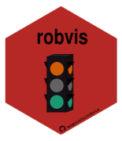
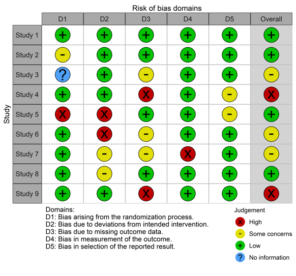
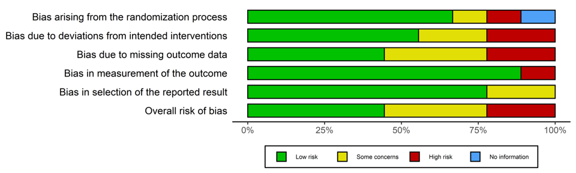
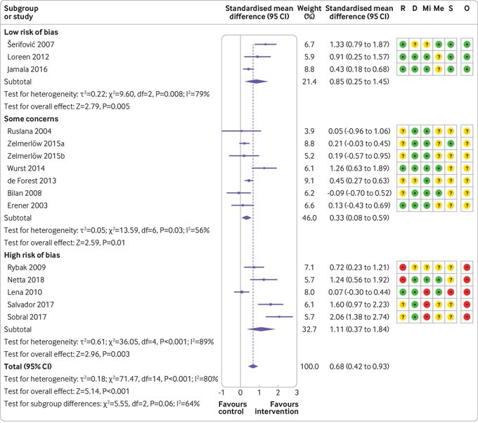
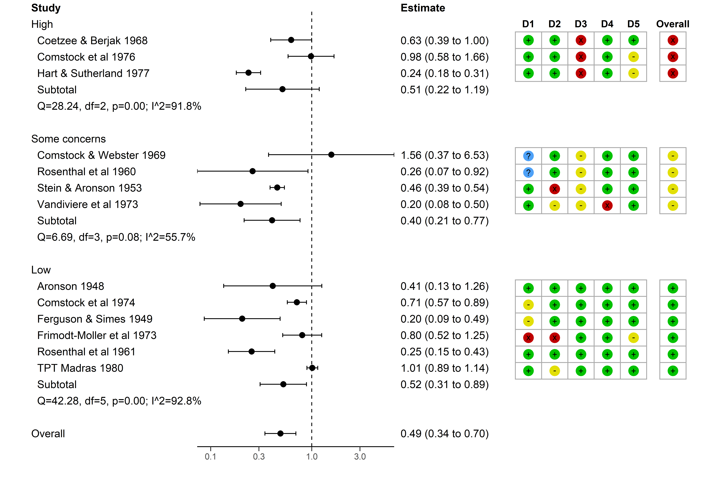
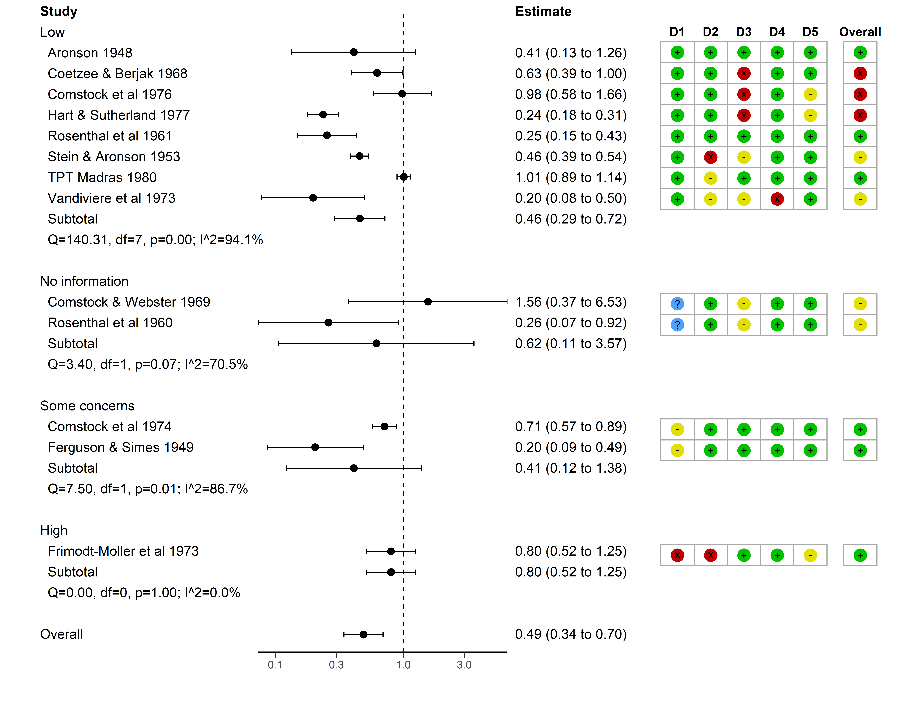

---
output:
  xaringan::moon_reader:
    css: [default, hygge, custom.css]
    lib_dir: libs
    nature:
      beforeInit: "cols_macro.js"
      highlightStyle: github
      ratio: '16:9'
      highlightSpans: true
      highlightLines: true
      countIncrementalSlides: false
      slideNumberFormat: |
        <div class="progress-bar-container">
          <div class="progress-bar" style="width: calc(%current% / %total% * 100%);">
          </div>
        </div>
---

```{r setup, include=FALSE}
options(htmltools.dir.version = FALSE)
knitr::opts_chunk$set(include = FALSE)
```

``` {r, echo = FALSE, message = FALSE}
htmltools::includeCSS("https://raw.githubusercontent.com/malcolmbarrett/kakashi/master/kakashi.css")
library(robvis)
cache <- TRUE
library(dplyr)
xaringanExtra::use_xaringan_extra(c("tile_view", "webcam"))
xaringanExtra::use_logo("https://github.com/mcguinlu/robvis/blob/master/man/figures/robvis_hex_box.png?raw=true")
```

.col-right2[
.center[

]
]

## Incorporating risk-of-bias assessments into evidence syntheses with `robvis`

<br>

__Luke McGuinness__<br>
(with Alex Fowler and Randall Boyes)


.small[
.image-smallest[] Population Health Sciences, University of Bristol

.image-smallest[] mcguinlu

.image-smallest[] mcguinlu
]

???

Hello, I'm Luke McGuinness, a PhD student at the University of Bristol Medical School

Sorry I couldn't attend this presentation live in the chat - due to the time different, it clashed with a family event.

I'm going to talk today about incorporating the resuls of risk-of-bias assessments int

And just to note that all the work presented today would not have been possible without my amazing collaborators, Alex Fowler and Randall Boyes


---

## Public Service Announcement

__I pronounce the letter "R" oddly:__

.center[

.col-left[
  
R  
("oar")
]

.col-right[
   
R  
("arr")
]

<br>
<br>
<br>

.col-center[.Large[.bold[means]]]
]

<br>
<br>
<br>
<br>
<br>
<br>

---

## Risk-of-bias assessments

Forms __core__ part of __systematic reviews__

???

Assessed using tools, which vary by study design

--

__Different tools__ for different __study designs__ (e.g. RoB2, ROBINS-I, QUADAS-2)

--

Bias assessed in __different domains__ (e.g. randomisation)

--

Each result include in review gets a __judgement in each domain__, plus an __overall judgement__

--

Judgements __vary by tool__ (e.g. Low, Some concerns, High)

---

##  The `robvis` package 

__R package__ and __web app__ to create publication-quality risk-of-bias visualisations

__Currently can produce two types of plots:__
* Traffic-light plots
* Summary barplots

??? 

robvis built to make these data more visually appealing

---

class: center

## Traffic-light plots

.image-small[]

???

Example presented is of RoB2 tool for RCT

Studies along the right hand side, domains of bias along the left

---
class: center
##  Summary bar-plots 

<br>



???

Same data as before just presented as a bar chart instead

---

class: large

##  Limitations of the current approach 

.pull-left[
.small[
Risk-of-bias assessments are performed __BUT__ data is relegated to the supplementary material

Better to try and __pair__ the assessments to their respective results

Also useful to perform __sub-group meta-analysis__ by risk-of-bias level
]
]

.pull-right[


]

???

Insufficient to simply perform the assessments, create the figure and not actively think about what this means for your meta-analysis

---

class: middle

##  Building on metafor 

_Paired_ forest/risk-of-bias plots


---

### Explore the datasets

`metafor` data - 13 trials of effectiveness of BCG vaccine against tuberculosis

```{r}

library(metafor)
library(robvis)

```

```{r dataset, include = TRUE}
dat.bcg
```

---

### Explore the datasets

`robvis` data - 13 (fake) risk of bias assessments performed using RoB2 for randomised trials


```{r dataset2}
dat.bcg.rob <- rbind(robvis::data_rob2, robvis::data_rob2[1:4,])
dat.bcg.rob$Study <- paste(dat.bcg$author,dat.bcg$year)

```

```{r dataset3, include =TRUE}
dat.bcg.rob
```

??? 

Note that these are example assessments from the robvis package

Doubling up to make the N of studies match the N of assessments

Notice that the names are the same

---

#### Standard approach

```{r meta-analysis, include = TRUE}
# Calculate the effect size and sampling variance for each study
dat <- metafor::escalc(
    measure = "RR",
    ai = tpos, bi = tneg, ci = cpos, di = cneg,
    data = dat.bcg, 
    slab = paste(author, year))

# Perform meta-anlysis and plot results
res <- metafor::rma(yi, vi, data = dat)

```

???

So we use the escalc function to generate our study effect sizes and sampling variances from the raw counts

This data is then passed to a simple random effects meta-analytical model, and the results are stored in the `res` object.

---

#### Standard approach

```{r, include = TRUE, message=FALSE, fig.align="center", fig.width=7}

metafor::forest(res)

```

???

Once we have the results of our meta-analysis

And this is the standard approach.

I'm now going to walk you through two ways in which robvis can add to this standard approach.

---

#### Option #1: `rob_append_to_forest()`

```{r, include = TRUE, message=FALSE, fig.align="center", fig.width=7, fig.height=6}
robvis::rob_append_to_forest(res, dat.bcg.rob)
```

???

This function acts as a wrapper to the metafor::forest function and appends a risk of bias plot to the right hand side

Important that the study names are the same in both the results object and the risk of bias dataset (for matching)

This is only possible due to the foresight of the metafor package developer, who ensured that the forest function could be built upon.

---

#### Option #2: `rob_blobbogram()`


```{r, include = FALSE}
rob_blobbogram(res, dat.bcg.rob,file_path = "figures/forester.png")
```

```{r, include = TRUE, eval = FALSE}
rob_blobbogram(res, dat.bcg.rob)
```

```{r forest, fig.align='center', include = TRUE, echo = FALSE, out.width="60%"}

```

???

Option to is a bit more sophisticated

Takes whatever meta-analytical model you have specified (though limited to metafor for now) and applies it across studies grouped by risk of bias level.

This function leans heavily on the amazing forester package built by Randall Boyes

This function is still in development, and so some aspect are not finalised - for example, we still need to improve reporting by subgroup and make it clearer which are study vs summary effects

Though, who knows potentially by the time you all see this next week, I'll have worked out the last few issues!

---

#### Option #2: `rob_blobbogram()`

```{r, include = FALSE}
rob_blobbogram(res, dat.bcg.rob, subset_col = "D1", file_path = "figures/forester2.png")
```

```{r, include = TRUE, eval = FALSE}
rob_blobbogram(res, dat.bcg.rob, subset_col = "D1")
```

```{r forest2, fig.align='center', include = TRUE, echo = FALSE, out.width="55%",out.height="90%"}

```

??? One potential added advantage of this approach is that you can subset the studies based not only on the overall risk of bias, but on any of the domains.

So here, we are subsetting by D1 which in the ROB2 tool is bias due to randomisation

---

class: largest


##  Take-home messages 

__For users__
* Risk-of-bias assessments should be __presented alongside the corresponding result__
* Risk-of-bias level should be investigated as a __source of heterogeneity__

--

__For developers__
* Keep an eye out for potential ways to __build on existing evidence synthesis__ packages to expand user functionality
* On the flip-side, think about how others might build on your packages (and what information they'll need!)


---

class: larger

##  Further info 

__See docs/info at:__
* Package website: [mcguinlu.github.io/robvis/](https://mcguinlu.github.io/robvis)
* Shiny app: [mcguinlu.shinyapps.io/robvis/](https://mcguinlu.shinyapps.io/robvis/)
	
__Paper introducing `robvis`:__
* McGuinness, L. A., & Higgins, J. P. (2020). Risk-of-bias VISualization (robvis): An R package and Shiny web app for visualizing risk-of-bias assessments. Research Synthesis Methods .

__Contribute to the package__:
* Open an issue on the GitHub repository
* Tweet at me ([@mcguinlu](https://twitter.com/mcguinlu))
* Send me an email (luke.mcguinness@bistol.ac.uk)

<br>

.center[__Thanks again to Randall Boyes and Alex Fowler for all their support!__]
