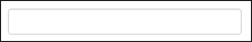

```{r setup, include=FALSE}
options(htmltools.dir.version = FALSE)
library(countdown)
library(shiny)
library(kableExtra)
library(BristolVis)
library(flair)
```

# Overview of this session

- Background to .cb[`shiny`]

- Getting started

  - Set-up

  - Control widgets & User interface

  - Outputs

--

- Getting more from .cb[`shiny`]

  - Execution
    
  - Customising your app
  
  - Reactive programming
  
  - Publishing your app

---

# Public Service Announcements

.Large[
__Workshop plan__
]
.large[
* Lecture followed by workshop
* There will be a break for coffee in the middle
]

<br>

--

.Large[
__Please ask questions as we go along!__
]
<br>


---

# Public Service Announcements
.Large[
__I pronounce the letter "R" oddly:__
]

.center[

.col-left[
  
R  
("oar")
]

.col-right[
   
R  
("arr")
]
<br>
<br>
<br>
.col-center[.Large[.bold[means]]]
]
<br>
<br>
<br>
<br>
<br>
<br>

---

class: inverse, middle, center

# Introduction: <br> Background to `shiny`

---
## What is .cb[`shiny`]?

.cb[`shiny`] is an R package that allows users to build interactive web applications ("apps") straight from R.

<br>

.center[

]

---

## What does Shiny do?

<iframe src="https://mcguinlu.shinyapps.io/shiny-teaching-apps/" class="foo" width="1400"  height="475" scrolling="no" frameBorder="0"></iframe>

.small[
_Data shown is from the `med` dataset used in this practical_
]
---

## What does Shiny do?

```{r, out.width = "900px", echo = FALSE}

```

---

## Structure of a .cb[`shiny`] app

A .cb[`shiny`] app has three components:

* .large[.bold[User interface]]

  * Defines the layout of your app
  * Controls what it looks like (themes/fonts/etc)
  
--

* .large[.bold[Server]]

  * Defines the logic needed to build the app
  * Performs computational work 
  
--

* .large[.bold[Call to the .cb[`shinyApp`] function]]

  * Creates the app from an user interface and server pair


---

## Inputs and outputs

Information moves between the UI and the server via inputs and outputs

NB: No computation takes place in UI - only the server can run R functions

.center[

]

---

## A simple app: add two numbers

<br>

``` {r, eval = FALSE}
ui <- fluidPage( 

  # Allow user to define two numbers
  numericInput(inputId = "add_1", label = "Number:", value = 0),
  numericInput(inputId = "add_2", label = "Number:", value = 0),

  # Display the output
  textOutput(outputId = "sum")
)

server <- function(input, output) {
  
  output$sum <- renderText({
    input$add_1 + input$add_2
  })
}

shinyApp(ui = ui, server = server)

```

---

## Reactive programming

.Large[
* Outputs (the sum of two numbers) *take a dependency on* inputs (the numbers being added)
* When the inputs change, the outputs change
]

<br>
<br>


```{r, echo = FALSE,fig.align = 'center'}
knitr::include_graphics("figs/reactive.png")
```

---

## A simple app: add two numbers

<br>

``` {r app_1, eval = FALSE, echo = FALSE}
ui <- fluidPage( 

  # Allow user to define two numbers
  numericInput(inputId = "add_1", label = "Number:", value = 0),
  numericInput(inputId = "add_2", label = "Number:", value = 0),

  # Display the output
  textOutput(outputId = "sum")
)

server <- function(input, output) {
  
  output$sum <- renderText({
    input$add_1 + input$add_2
  })
}

shinyApp(ui = ui, server = server)

```

```{r, echo = FALSE}

decorate("app_1", eval = FALSE) %>%
  flair("add_1", color = "blue",bg_color = "#ffff7f", bold = TRUE) 

```

---

## A simple app: add two numbers

<br>

```{r, echo = FALSE}

decorate("app_1", eval = FALSE) %>%
  flair("add_1", color = "blue",bg_color = "#ffff7f", bold = TRUE) %>%
  flair("add_2", color = "#66ff00",bg_color = "#ffff7f", bold = TRUE) 

```

---

## A simple app: add two numbers

<br>

```{r, echo = FALSE}

decorate("app_1", eval = FALSE) %>%
  flair("add_1", color = "blue", bg_color = "#ffff7f", bold = TRUE) %>%
  flair("add_2", color = "#66ff00", bg_color = "#ffff7f", bold = TRUE) %>%
  flair("sum", color = "red", bg_color = "#ffff7f", bold = TRUE)

```

---

class: inverse, center, middle

# Getting started:  <br> Control widgets

---

## A widget for every occasion

Control widgets are used to capture user input and vary based on type of input:

.center[


Image sourced from the .cb[`shiny`] Rstudio [cheatsheet](https://shiny.rstudio.com/images/shiny-cheatsheet.pdf)
]

---

## The anatomy of a widget

We use the `numericInput` widget in our app

```{r, echo = FALSE}

decorate("app_1", eval = FALSE) %>%
  flair("numericInput") 

```

---

## The anatomy of a widget

All control widgets have two elements in common:

* __inputId__: Unique ID for that widget

* __label__: Text to be displayed beside the widget (which can be left blank)

```{r, eval =FALSE}
textInput(inputId = "textboxinput",
          label = "") 
```

.center[

]

Other elements are specific to the widget you are using:

```{r, eval=FALSE}
selectInput(inputId = "fillby",
            label = "Variable to fill by",
            choices = c("Health","treament")),

```

.center[

]

---

## The anatomy of a widget

The `inputId` must be unique, so that the value can be used in the server:

```{r, echo = FALSE}

decorate("app_1", eval = FALSE) %>%
  flair("add_1") %>%
  flair("add_2")
```

---

## The anatomy of a widget

The value of `label` can be duplicated across widgets:

```{r, echo = FALSE}

decorate("app_1", eval = FALSE) %>%
  flair("Number:") 

```

---

## The anatomy of a widget

Some widgets require a default value:

```{r, echo = FALSE}

decorate("app_1", eval = FALSE) %>%
  flair("value = 0") 

```

---

class: inverse, center, middle

# Getting started: <br> User Interface

---

## .cb[`sidebarLayout()`]

Common layout for .cb[`shiny`] apps

.center[


]

---

## .cb[`sidebarLayout()`]

``` {r, eval = FALSE}
ui <- fluidPage( 
  sidebarLayout(
    sidebarPanel(
      # Control widgets
    ),
    mainPanel(
      # Outputs
    )
  )
)
```


Conventions for use:
* The .cb[`sidebarPanel`] is usually used to house the control widgets that capture user input.

* The .cb[`mainPanel`] is usually used to present the output of the app (text/graph/results).

---

## Applying sidebarLayout() to our app

```{r, eval = FALSE}
ui <- fluidPage( 
  sidebarLayout( #<<
   sidebarPanel( #<<
      # Allow user to define two numbers
      numericInput(inputId = "add_1", label = "Number:", value = 0),
      numericInput(inputId = "add_2", label = "Number:", value = 0),
    ), #<<
    mainPanel( #<<
      # Display the output
      textOutput(outputId = "sum")
    ) #<<
  ) #<<
)  

server <- function(input, output) {
  
  output$sum <- renderText({
    input$add_1 * input$add_2
  })
}

shinyApp(ui = ui, server = server)
```


---

class: inverse, center, middle

# Creating your own app: <br> Reactive outputs

---

## Creating outputs - the basics

Add new functionality to show product of the two numbers?

.small[
``` {r, eval = FALSE}
ui <- fluidPage( 

  # Allow user to define two numbers
  numericInput(inputId = "add_1", label = "Number:", value = 0),
  numericInput(inputId = "add_2", label = "Number:", value = 0),

  # Display the output
  textOutput(outputId = "sum")
  
)

server <- function(input, output) {
  
  output$sum <- renderText({ 
    input$add_1 + input$add_2 
  }) 
  
  
  
  
}

shinyApp(ui = ui, server = server)

```
]

---

## Creating outputs - the basics

First, add code needed to create the output to the server using a .cb[`render*()`] function

.small[
``` {r, eval = FALSE}
ui <- fluidPage( 

  # Allow user to define two numbers
  numericInput(inputId = "add_1", label = "Number:", value = 0),
  numericInput(inputId = "add_2", label = "Number:", value = 0),

  # Display the output
  textOutput(outputId = "sum")
  
)

server <- function(input, output) {
  
  output$sum <- renderText({ 
    input$add_1 + input$add_2 
  }) 
  
  output$product <- renderText({ #<<
    input$add_1 * input$add_2 #<<
  }) #<<
}

shinyApp(ui = ui, server = server)

```
]

---

## Creating outputs - the basics

Add the resulting object to the user interface using the corresponding .cb[`*Output()`] function.


.small[
``` {r, eval = FALSE}
ui <- fluidPage( 

  # Allow user to define two numbers
  numericInput(inputId = "add_1", label = "Number:", value = 0),
  numericInput(inputId = "add_2", label = "Number:", value = 0),

  # Display the output
  textOutput(outputId = "sum")
  textOutput(outputID = "product") #<<
)

server <- function(input, output) {
  
  output$sum <- renderText({ 
    input$add_1 + input$add_2 
  }) 
  
  output$product <- renderText({ #<<
    input$add_1 * input$add_2 #<<
  }) #<<
}

shinyApp(ui = ui, server = server)

```
]

---

## Rendering the output

Similar to inputs, there are different .cb[`render\*()`]/.cb[`*Output()`] function pairs for different types of output:


.center[


Image sourced from the .cb[`shiny`] Rstudio [cheatsheet](https://shiny.rstudio.com/images/shiny-cheatsheet.pdf)

]

---

## Accessing widget values

The inputId of the widget is important

--
<hr>

For the following widget:

```{r, eval = FALSE}
numericInput(inputId = `add_1`, label = "Number:", value = 0)
```

its value is defined by 

```{r eval= FALSE}
input$`add_1`
```

???

shiny stores all userdefined information in a list-like object called "input"

---
## Using the value of the control widgets

.center[

]

---


## Using the value of the control widgets
.small[
**renderPlot() function in the server**
```{r eval=FALSE}
output$barPlot <- renderPlot({
       ggplot(data = med, aes_string(fill = `input$fill`)) +
          geom_histogram(aes(x = status), stat = "count")
       })
```
]

<hr>

--

.small[
**Changes based on value selected by user in UI**

When *input$fill = health*:

```{r eval=FALSE}
ggplot(data = med, aes_string(fill = `"health"`)) +
   geom_histogram(aes(x = status), stat = "count")
```
]

--

.small[
<br>
When *input$fill = treatment*:

```{r eval=FALSE}
ggplot(data = med, aes_string(fill = `"treatment"`)) +
   geom_histogram(aes(x = status), stat = "count") 
```
]

---

## Running an app

.large[.bold[There are two options when running your app:]]


Open the app by running .cb[`runApp("app-dir")`] in the console, where "app-dir" is the name of the directory containing your app.R script: 

```{r, eval=FALSE}
runApp("luke")
```

.center[
.bold[
.large[
OR
]
]
]

Open the app.R script in Rstudio and then:

* click the "Run App" button:

.center[]

* Use the keyboard short-cut: _Ctrl/Command+Shift+Enter_

---

## Introducing the data
.large[
The dataset we will use for the practical elements is the .cb[`bmi2`] dataset included with the BristolVis package:
]

```{r, echo=FALSE, width = 800}

bmi2 <- tibble::tribble(
  ~id,  ~age,  ~bmi,      ~sex,    ~diet,         ~status,
   1, 78.2, 29.3,   "Male", "Good", "Unhealthy",
   2, 48.5,   33, "Female", "Good", "Unhealthy",
   3, 79.5, 31.5, "Female", "Good", "Unhealthy",
   4, 78.5, 28.1,   "Male", "Poor",   "Healthy"
  )

kable(head(bmi2[1:4,]),row.names = FALSE)
```

.large[
The data set contains 200 observations across the following six variables:

.pull-left[
__Continuous variables:__

* id
* age
* bmi

]

.pull-right[
__Categorical variables:__

* sex: Male / Female
* diet: Good / Moderate / Poor
* status: Healthy / Unhealthy

]
]


---

## Images
Oar: By Florian Pépellin - Own work, CC BY-SA 3.0, https://commons.wikimedia.org/w/index.php?curid=43042720