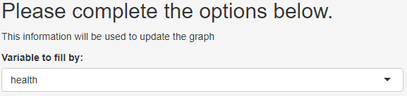
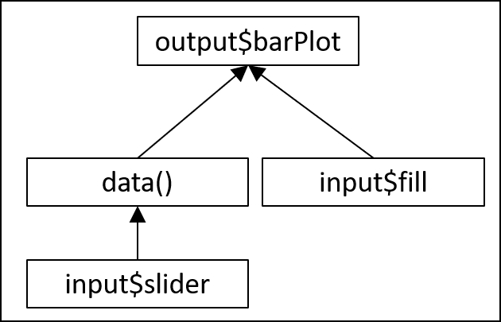

```{r setup, include=FALSE}
options(htmltools.dir.version = FALSE)
library(countdown)
library(shiny)
library(kableExtra)
library(BristolVis)
library(flair)
```

# Overview of this session


- Background to .cb[`shiny`]

- Getting started

  - Set-up

  - Control widgets & User interface

  - Outputs

--

- Getting more from .cb[`shiny`]

  - Execution
    
  - Customising your app
  
  - Reactive programming
  
  - Publishing your app

---

### New example!

Can anyone describe what this app does?

``` {r, eval = FALSE}
library(shiny) 
library(ggplot2) 

med <- read.csv("http://bit.ly/bris-data-viz-med") 

ui <- fluidPage(
      selectInput(inputId = "fill",
                  label = "Variable to fill by:",
                  choices = c("health","treatment")),
      
      plotOutput("barPlot")
)

server <- function(input, output) {
  
  output$barPlot <- renderPlot({
    
      ggplot(data = med, aes_string(fill = input$fill)) +
      geom_histogram(aes(x = status), stat = "count")
    
      })
}

shinyApp(ui = ui, server = server) 
```

---

### New example!

Imports `med` dataset...

``` {r, eval = FALSE}
library(shiny) 
library(ggplot2) 

med <- read.csv("http://bit.ly/bris-data-viz-med") #<<

ui <- fluidPage(
      selectInput(inputId = "fill",
                  label = "Variable to fill by:",
                  choices = c("health","treatment")),
      
      plotOutput("barPlot")
)

server <- function(input, output) {
  
  output$barPlot <- renderPlot({
    
      ggplot(data = med, aes_string(fill = input$fill)) +
      geom_histogram(aes(x = status), stat = "count")
    
      })
}

shinyApp(ui = ui, server = server) 
```

---

### New example!

Which is used to create a barplot using `ggplot2`...

``` {r, eval = FALSE}
library(shiny) 
library(ggplot2) 

med <- read.csv("http://bit.ly/bris-data-viz-med") 

ui <- fluidPage(
      selectInput(inputId = "fill",
                  label = "Variable to fill by:",
                  choices = c("health","treatment")),
      
      plotOutput("barPlot")
)

server <- function(input, output) {
  
  output$barPlot <- renderPlot({
    
      ggplot(data = med, aes_string(fill = input$fill)) + #<<
      geom_histogram(aes(x = status), stat = "count") #<<
    
      })
}

shinyApp(ui = ui, server = server) 
```

---

### New example!

With user defined "fill" variable, captured by an input widget

``` {r, eval = FALSE}
library(shiny) 
library(ggplot2) 

med <- read.csv("http://bit.ly/bris-data-viz-med") 

ui <- fluidPage(
      selectInput(inputId = "fill", #<<
                  label = "Variable to fill by:", #<<
                  choices = c("health","treatment")), #<<
      
      plotOutput("barPlot")
)

server <- function(input, output) {
  
  output$barPlot <- renderPlot({
    
      ggplot(data = med, aes_string(fill = input$fill)) +
      geom_histogram(aes(x = status), stat = "count")
    
      })
}

shinyApp(ui = ui, server = server) 
```

---

class: inverse, center, middle

# Getting more from `shiny`: <br> Execution

---

## Where you put your code is important

.Large[

In the example, we loaded the  .cb[`shiny`] and .cb[`ggplot2`] packages using:

```{r,eval=FALSE}
library(shiny)
library(ggplot2)
```

Due to the way your app is executed, it is important that this is put outside both the user interface container and the server

If you are .cb[`source()`]-ing additional .cb[`.R`] files, these commands should also go here

__This is particularly relevant when loading large data files__

]

---

## When is your code run?

Only ever once, when the app is launched

``` {r, eval = FALSE}
library(shiny) #<<
library(ggplot2) #<<

med <- read.csv("http://bit.ly/bris-data-viz-med") #<<

ui <- fluidPage(
      selectInput(inputId = "fill",
                  label = "Variable to fill by:",
                  choices = c("health","treatment")),
      plotOutput("barPlot")
)

server <- function(input, output) {
  
   output$barPlot <- renderPlot({ 
     
      ggplot(data = med, aes_string(fill = input$fill)) + 
      geom_histogram(aes(x = status), stat = "count") 
     
      }) 
} 

shinyApp(ui = ui, server = server) #<<

```

---

## When is your code run?

Once each time a new user visits

``` {r, eval = FALSE}
library(shiny)
library(ggplot2)

med <- read.csv("http://bit.ly/bris-data-viz-med") 

ui <- fluidPage(
      selectInput(inputId = "fill",
                  label = "Variable to fill by:",
                  choices = c("health","treatment")),
      plotOutput("barPlot")
)

server <- function(input, output) { #<<
  
   output$barPlot <- renderPlot({ #<<
     
      ggplot(data = med, aes_string(fill = input$fill)) + #<<
      geom_histogram(aes(x = status), stat = "count") #<<
     
      }) #<<
} #<<

shinyApp(ui = ui, server = server)

```

---

## When is your code run?

Each time the value of .cb[`input$fill`] changes (_reactive outputs_)

``` {r, eval = FALSE}
library(shiny) 
library(ggplot2) 

med <- read.csv("http://bit.ly/bris-data-viz-med")

ui <- fluidPage(
      selectInput(inputId = "fill",
                  label = "Variable to fill by:",
                  choices = c("health","treatment")),
      plotOutput("barPlot")
)

server <- function(input, output) { 
  
   output$barPlot <- renderPlot({ 
     
      ggplot(data = med, aes_string(fill = input$fill)) + #<<
      geom_histogram(aes(x = status), stat = "count") #<<
     
      }) 
} 

shinyApp(ui = ui, server = server)

```

---

class: inverse, center, middle

# Getting more from `shiny`: <br> Page layout

---

## Alternatives to .cb[`sidebarLayout()`]

.large[__.cb[`fluidRow()`]__]
```{r,eval=FALSE}
ui <- fluidPage(
 fluidRow(column(width= 4),
          column(width= 2), offset= 3),
 fluidRow(column(width= 12))
 ) 
```

.center[

]

---

## Alternatives to .cb[`sidebarLayout()`]

.large[__.cb[`splitLayout()`]__]
```{r,eval=FALSE}
ui <- fluidPage(
 splitLayout( 
    # object 1,
    # object 2
 )
)  
```
.center[

]

---


class: inverse, center, middle

# Getting more from `shiny`: <br> Making `shiny` sparkle

---

## A .cb[`shiny`] UI is a HTML document

Can use HTML ___tags___ to add static elements (such as text) to your app.

For example, in the user interface:

``` {r, eval=FALSE}
ui <- fluidPage(
  h2("Please complete the options below."), #<<
  p("This information will be used to update the graph"), #<<
  selectInput(inputId = "fill",
              label = "Variable to fill by:",
              choices = c("health","treatment"))
)
```
<br>

.center[

]

---

## Adding HTML ___tags___

.large[
The most common HTML tags have wrapper functions to make them easier to use:
]

``` {r, eval=FALSE}
ui <- fluidPage(         
 h1("Header 1"),              # header (can be h1-h6)
 hr(),                        # horizontal rule
 br(),                        # line break
 p("Text"),                   # paragraph text
 p(strong("bold")),           # bold
 p(em("italic")),             # italics         
 p(code("code")),             # code highlighting         
 a(href="", "link"),          # Hyperlink            
 HTML("<p>Raw html</p>")      # Raw html                
)    
```

.large[
Some tags, e.g. .cb[em()] and .cb[strong()] must be nested within a paragraph tag, .cb[p()]

Similar to the control widgets, all tags are followed by a comma, except for the last element in the user interface container

A full list of tags is available on the .cb[`shiny`] Rstudio [cheatsheet](https://shiny.rstudio.com/images/shiny-cheatsheet.pdf)

]

---

Add some text to our example app:

``` {r, eval = FALSE}
library(shiny) 
library(ggplot2) 

med <- read.csv("http://bit.ly/bris-data-viz-med")

ui <- fluidPage(
      p("Use the option below to customise your chart:"), #<<
      selectInput(inputId = "fill",
                  label = "Variable to fill by:",
                  choices = c("health","treatment")),
      
      
      hr(), #<<
      p("Here is your plot:"), #<<
      plotOutput("barPlot")
)

server <- function(input, output) { 
  
   output$barPlot <- renderPlot({ 
     
      ggplot(data = med, aes_string(fill = input$fill)) + 
      geom_histogram(aes(x = status), stat = "count") 
     
      }) 
} 

shinyApp(ui = ui, server = server)

```


---

class: inverse, center, middle

# Getting more from `shiny`: <br> Reactive programming

---

New example!

``` {r, eval = FALSE}
library(shiny) 
library(ggplot2) 
med <- read.csv("http://bit.ly/bris-data-viz-med") 

ui <- fluidPage(
      selectInput(inputId = "fill",
                  label = "Fill:",
                  choices = c("health","treatment")),
      
      sliderInput(inputId = "slider",
                  label = "Number of rows to plot in figure:",
                  value = 100,
                  min = 5,
                  max = 150),
      
      plotOutput("barPlot")
)

server <- function(input, output) {
  
  output$barPlot <- renderPlot({
      med <- head(med, input$slider)
    
      ggplot(data = med, aes_string(fill = input$fill)) +
      geom_histogram(aes(x = status), stat = "count")
      })
}

shinyApp(ui = ui, server = server) 
```

???

Take your time with this!

Ask them to explain it

---

Capture two user inputs: "fill" variable and number of rows to plot ("slider")

``` {r, eval = FALSE}
library(shiny) 
library(ggplot2) 
med <- read.csv("http://bit.ly/bris-data-viz-med") 

ui <- fluidPage(
      selectInput(inputId = "fill", #<<
                  label = "Fill:", #<<
                  choices = c("health","treatment")), #<<
      
      sliderInput(inputId = "slider", #<<
                  label = "Number of rows to plot in figure:", #<<
                  value = 100, #<<
                  min = 5, #<<
                  max = 150), #<<
      
      plotOutput("barPlot")
)

server <- function(input, output) {
  
  output$barPlot <- renderPlot({
      med <- head(med, input$slider)
    
      ggplot(data = med, aes_string(fill = input$fill)) +
      geom_histogram(aes(x = status), stat = "count")
      })
}

shinyApp(ui = ui, server = server) 
```


---

Use these inputs to create a barplot using the `med` dataset

``` {r, eval = FALSE}
library(shiny) 
library(ggplot2) 
med <- read.csv("http://bit.ly/bris-data-viz-med") 

ui <- fluidPage(
      selectInput(inputId = "fill",
                  label = "Fill:",
                  choices = c("health","treatment")),
      
      sliderInput(inputId = "slider",
                  label = "Number of rows to plot in figure:",
                  value = 100,
                  min = 5,
                  max = 150),
      
      plotOutput("barPlot")
)

server <- function(input, output) {
  
  output$barPlot <- renderPlot({
      med <- head(med, input$slider) #<<
    
      ggplot(data = med, aes_string(fill = input$fill)) + #<<
      geom_histogram(aes(x = status), stat = "count") #<<
      })
}

shinyApp(ui = ui, server = server) 
```

---

What does the output .cb[barPlot] take a dependency on?

``` {r, eval = FALSE}
library(shiny) 
library(ggplot2) 
med <- read.csv("http://bit.ly/bris-data-viz-med") 

ui <- fluidPage(
      selectInput(inputId = "fill",
                  label = "Fill:",
                  choices = c("health","treatment")),
      
      sliderInput(inputId = "slider",
                  label = "Number of rows to plot in figure:",
                  value = 100,
                  min = 5,
                  max = 150),
      
      plotOutput("barPlot") #<<
)

server <- function(input, output) {
  
  output$barPlot <- renderPlot({
      med <- head(med, input$slider) 
    
      ggplot(data = med, aes_string(fill = input$fill)) + 
      geom_histogram(aes(x = status), stat = "count")
      })
}

shinyApp(ui = ui, server = server) 
```

---

## Shiny is reactive . . . 

.cb[`output$barplot`] depends on the value of **both** .cb[`input$slider`] and .cb[`input$fill`]:

``` {r, eval = FALSE}
server <- function(input, output) {

 output$barPlot <- renderPlot({
      data <- head(med, n = `input$slider`) 
      
      ggplot(data = data, aes_string(fill = `input$fill`)) +
      geom_histogram(aes(x = status), stat = "count")
  })
}
```

When either .cb[`input$slider`] and .cb[`input$fill`] changes, all the code contain within the .cb[`renderPlot()`] function will run

???

As we spoke about previous, shiny outputs depend on shiny inputs

---

## . . . but in a lazy way

Compare what happens when we change .cb[`input$fill`] in the following:

``` {r, eval = FALSE}
server <- function(input, output) {

 output$barPlot <- renderPlot({
      `data` <- head(med, n = `input$slider`) 
      
      ggplot(data = `data`, aes_string(fill = `input$fill`)) +
      geom_histogram(aes(x = status), stat = "count")
  })}
```

versus:

``` {r, eval = FALSE}
server <- function(input, output) {
  `data` <- reactive({
        head(med, n = `input$slider`) 
  })

 output$barPlot <- renderPlot({
    ggplot(data = `data()`, aes_string(fill = `input$fill`)) +
      geom_histogram(aes(x = status), stat = "count")
  })}
```

---

## The .cb[`reactive({ })`] function

.large[

The difference: changing the value of .cb[`input$fill`] in the second example does not require the data to be re-calculated


* `renderPlot` calls `data()`
]

```{r, eval=FALSE}
data <- `reactive({` head(med, n = input$slider) `})`
```

.large[
* `data()` will check that the value of `input$slider` has not changed
* `data()` will return its saved data ___without___ re-subsetting the _med_ dataset
* `renderPlot` will re-draw the histogram with the correct fill.  
]

.center[

]

???

Important when, for example, loading big datasets from the web -> time consuming if all you want to do is change the title. . . 

---

## The .cb[`reactive({ })`] function

Shiny caches the results of .cb[`data()`] and continuously validates the value of .cb[`input$slider`] on which it depends. 

Being able to separate out computationally intense steps in your app is useful, as it prevents Shiny from re-running code unnecessarily. 

For example, reloading and cleaning a large datasets from the web each time the user makes a change to a plot title is inefficient


---

class: inverse, center, middle

# Getting more from `shiny`: <br> Sharing/publishing your app

---

## Sharing/publishing your app

At the moment, your app is only available to you locally

To make it widely available, you need to publish it

Lots of ways to do this, but easiest is via shinyapps.io:

* Ensure that your app.R file is contained within its own folder

* Go to [shinyapps.io](https://www.shinyapps.io/)

* Follow the instructions there to publish your app

---

## Sharing/publishing your app

Why publish?

* Makes your code available to anyone with an internet connection

* Good way to showcase your work

* Can make a nice compliment to an R package, as it does not require users to know R

---

## Wrapping up

.Large[
While the apps we built today are quite simple, the possibilities with .cb[`shiny`] are endless:
<br>
.pull-left[
.center[
[Example 1](https://mcguinlu.shinyapps.io/robvis/)
]
]
.pull-right[
.center[
[Example 2](https://committedtotape.shinyapps.io/sixtyninelovesongs/)
]
]

<br>
Please do get in touch if I can be of help:

* Email: [luke.mcguinness@bristol.ac.uk](mailto:luke.mcguinness@bristol.ac.uk)
* Twitter: [@mcguinlu](https://twitter.com/mcguinlu)
* GitHub: [@mcguinlu](https://github.com/mcguinlu)

]