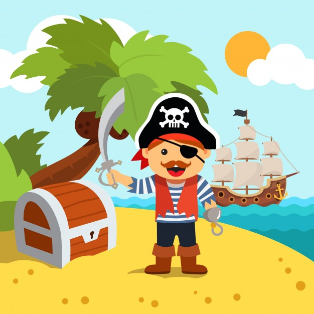
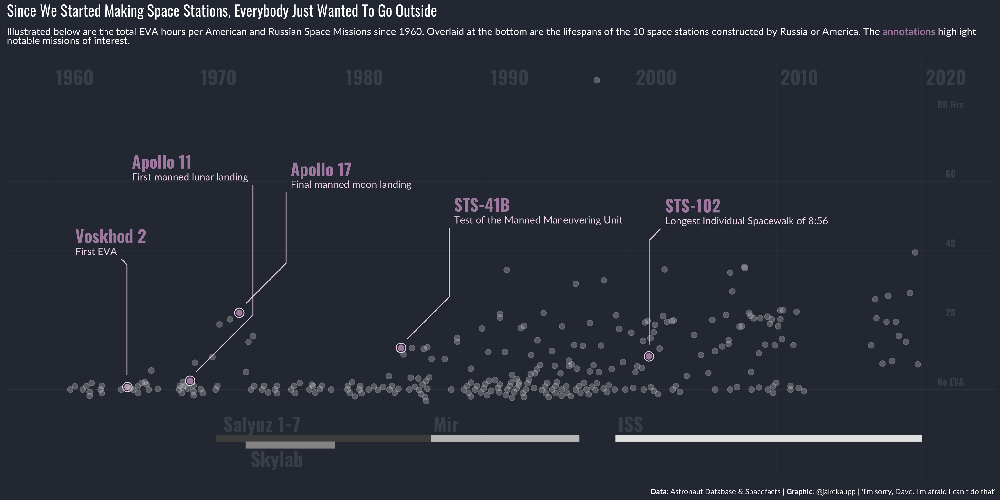
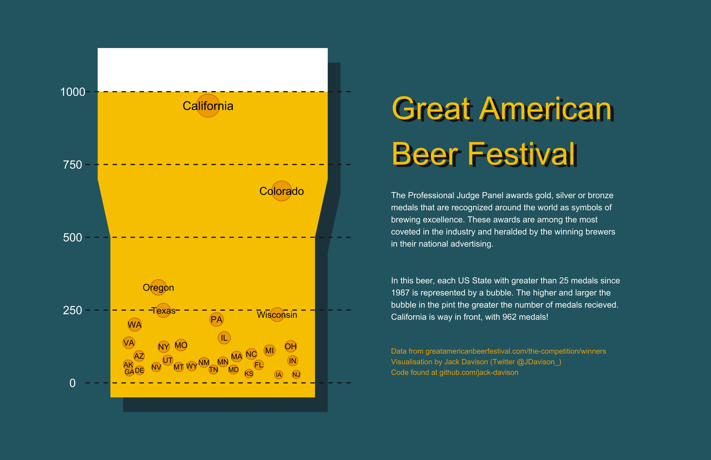
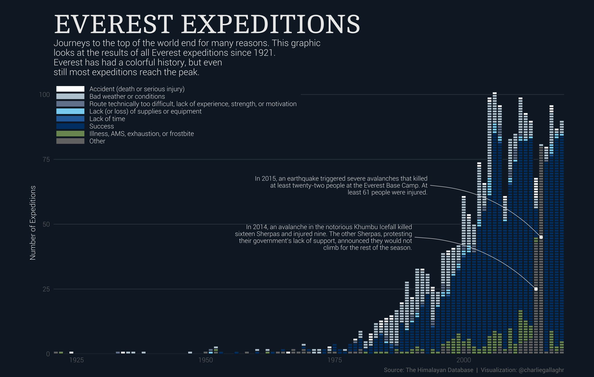
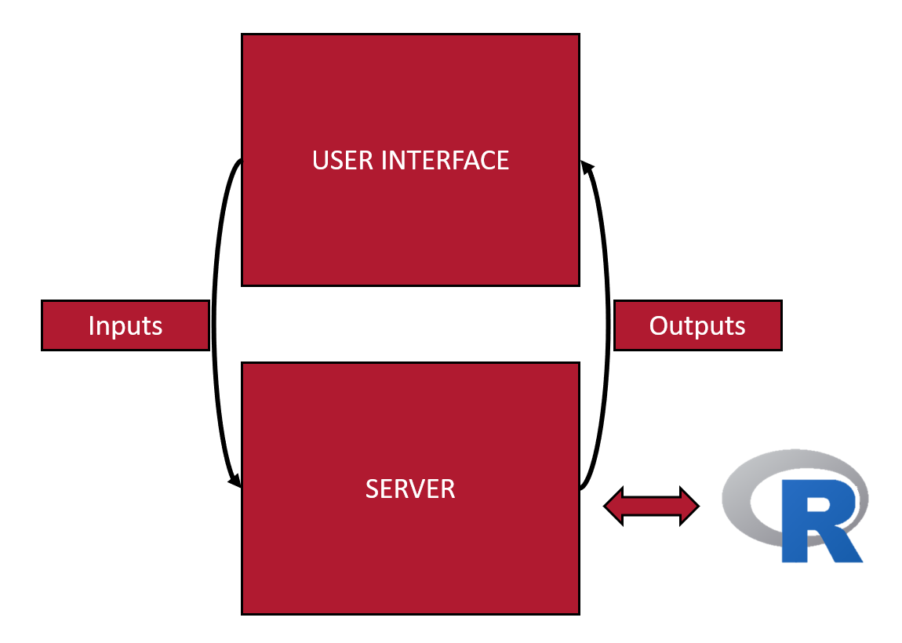

```{r setup, include=FALSE}
options(htmltools.dir.version = FALSE)
library(countdown)
library(tidyverse)
library(shiny)
library(kableExtra)
library(BristolVis)
library(printr)
library(ggthemes)
library(tufte)
library(dplyr)
knitr::opts_chunk$set(warning = F, message = F)
knitr::opts_chunk$set(fig.height = 8, out.width = "100%", comment = " ", cache = F, dpi = 700)

htmltools::includeCSS("https://raw.githubusercontent.com/malcolmbarrett/kakashi/master/kakashi.css")

xaringanExtra::use_xaringan_extra(c("tile_view", "webcam"))

source("https://raw.githubusercontent.com/EvaMaeRey/little_flipbooks_library/master/xaringan_reveal_parentheses_balanced.R")

source(file = "xaringan_reveal_parenthetical.R")
```

```{css, echo=FALSE}
code.r.hljs.remark-code {
  position: relative;
  overflow-x: hidden;
}

code.r.hljs.remark-code:hover {
  overflow-x: visible;
  width: 500px;
  border-style: solid;
}
```

# A brief intro to advanced topics


## - Create beautiful plots with `ggplot2`

--

## - Literate programming with `Rmarkdown`

--

## - Build interactive apps with `shiny`

--

## - Share your work as a package

???

Just to note that this is a jumping off point for reference. 

Slides are available from the link in your folders - lots of elements in this presentation are hyper-linked, so might be worth having a look.

---

# Public Service Announcement
.Large[
__I pronounce the letter "R" oddly:__
]

.center[

.col-left[
  
R  
("oar")
]

.col-right[
   
R  
("arr")
]
<br>
<br>
<br>
<br>
<br>
.col-center[.Large[.bold[means]]]
]
<br>
<br>
<br>
<br>

---

class: inverse, middle, center

# Pretty plots: <br> Intro to `ggplot2`

---

# ggplot2

.Large[

A package to create highly customisable publication-ready plots

Key elements:

* .bold[aesthetic]: what you want to graph (e.g. x, y, colours, etc)

* .bold[geom]: how you want to graph it (e.g. scatterplot, histogram)

* .bold[options]: optional titles, themes, etc.

<br>

Elements are added together using **+**

]

???

Can do plots in base R, as Matt showed you earlier

Advantage of using ggplot is greater control over the layout

Base plots fine for doing simple exploratory figures - anything more, you'll want ggplot2

---

## .yt[The `bmi2` dataset]
.large[
The dataset used for the following graphics contains 200 observations across the following six variables:
]

```{r, echo=FALSE, width = 800}

bmi2 <- tibble::tribble(
  ~id,  ~age,  ~bmi,      ~sex,    ~diet,         ~status,
   1, 78.2, 29.3,   "Male", "Good", "Unhealthy",
   2, 48.5,   33, "Female", "Good", "Unhealthy",
   3, 79.5, 31.5, "Female", "Good", "Unhealthy",
   4, 78.5, 28.1,   "Male", "Poor",   "Healthy"
  )

kable(head(bmi2[1:4,]),row.names = FALSE)
```

Install and load the `ggplot2` package, and download a copy of the dataset to follow along:

```{r, eval = FALSE}
install.packages("ggplot2")
library("ggplot2")

df <- read.csv("http://bit.ly/phd-intro-bmi2")
```

???

So we're going to jump right in and make a plot:

---

```{r, echo = F}
df <- read.csv("http://bit.ly/phd-intro-bmi2")
```

```{r christmas, eval=F, echo=F}
ggplot(data = df) +
aes(x = age) +
aes(y = bmi) +
geom_point() +
aes(colour = sex) +
geom_smooth(method = "lm", se = F) +
scale_color_manual(values = 
                     c("blue", "purple")) +
ylim(c(15, 35)) +
labs(x = "Age",
     y = "Body Mass Index (BMI)",
     colour = "") +
labs(title = "BMI by Age") +
labs(subtitle = "Colour indicates sex")
```

```{r, echo = F, warning=F, message=F, eval = T, fig.show='hide'}
get_what_save_what <- "christmas"
eval(parse(text = paste(knitr:::knit_code$get(get_what_save_what), collapse = "")))
ggsave(paste0("figures/", get_what_save_what, ".png"), dpi = 700)
```


`r apply_reveal("christmas")`

---

```{r christmas8, eval=F, echo=F}
ggplot(data = df) +
aes(x = age) +
aes(y = bmi) +
geom_point() +
geom_smooth(method = "lm", se = F) +
theme_bw() +
theme_void() +
theme_classic() +
ggthemes::theme_economist() +
ggthemes::theme_stata()
```

```{r, echo = F, warning=F, message=F, eval = T, fig.show='hide'}
get_what_save_what <- "christmas8"
eval(parse(text = paste(knitr:::knit_code$get(get_what_save_what), collapse = "")))
ggsave(paste0("figures/", get_what_save_what, ".png"), dpi = 700)
```

`r apply_reveal("christmas8")`

???

Rather than using predefined themes, going to showcase how you can edit specific elements of your plots

---

```{r christmas2, eval=F, echo=F}
ggplot(data = df) +
aes(x = status) +
geom_histogram(stat = "count") +
aes(fill = diet) +
labs(fill = "Diet status") +
labs(title = "Number of people by status",
     subtitle = "Colour indicates diet", 
     x = "Status", 
     y = "Number of people") +
theme(axis.title=element_text(colour="red"))+
theme(legend.position = "bottom") +
theme(panel.grid = element_blank()) +
theme(panel.background=element_rect(fill="black")) +
theme(title = element_text(size = 20)) 
```

```{r, echo = F, warning=F, message=F, eval = T, fig.show='hide'}
get_what_save_what <- "christmas2"
eval(parse(text = paste(knitr:::knit_code$get(get_what_save_what), collapse = "")))
ggsave(paste0("figures/", get_what_save_what, ".png"), dpi = 700)
```

`r apply_reveal("christmas2")`

---

class: large

# Virtually endless customisability

Plots on previous slides are only a taster

Can make any plot you can think up

Key resources, both open-source:

* [`ggplot2` documentionation and cheatsheet](https://ggplot2.tidyverse.org/) - great starting point.

* ["Data visualisation"](https://socviz.co/) by Kieran Healy - great introductory text on the science of data visualization, with examples in R.

* [Tidy Tuesday](https://github.com/rfordatascience/tidytuesday) - weekly community-run visualization exercise

---

.center[
   
]

---

.center[

   
]

---

.center[
   
]

---

# Recap

.Large[

Key concept is that you are adding elements together:

- first the data 

- then the elements of the data you want to display (`aesthetics`)

- then the way you want to display them (`geoms`)

- then extra options (colour/themes/titles)

]

---

class: inverse, middle, center

# Literate programming: <br> `R Markdown`

---

# `R Markdown`

.Large[

A single file (with `.Rmd` extension) that incorporates text, code and output (results and figures)

Can be converted to multiple formats:

* Word

* PDF

* HTML (web-page)

]

---

# Components of a `R Markdown` file

.Large[

**A (optional) YAML header surrounded by three hyphens (---)**

* Defines metadata, such as the title, author and date
* Defines the output format (Word, PDF, HTML, etc.)

**Code chunks: R code chunks surrounded by backticks (`) **

* This is where the core computation happens
* Can choose to show the underlying code or just the results

** Text with inline code** 

* Great for presenting results as part of a sentence
* E.g. The mean of the age variable was `` `r
mean(age)` ``


]

---

class: middle, center

# R Markdown Demo

---

class: large

# Why bother?


Improves reproducibility and transparency, as the origin of every single result in the paper can be examined

--

Makes updating a paper with new data really straightforward

--

Citations/figure placement/cross-reference all straightforward.


???

Avoids errors in copying numerical results into a manuscript

---

# Things you can produce using `R Markdown`

.Large[

* Academic papers

* Theses

* Supervisory reports (great if format is similar each time)

* Slides (this slide deck was made using `R Markdown`!)

]

---

class: large

# Resources

[R Markdown tutorial](https://rmarkdown.rstudio.com/lesson-1.html) from RStudio

[R Markdown: The Definitive Guide](https://bookdown.org/yihui/rmarkdown/) by 
Yihui Xie 

---

class: inverse, middle, center

# Making R accessible: <br> Intro to `shiny`

---

## What is .cb[`shiny`]?
.Large[
.cb[`shiny`] is an R package that allows users to build interactive web applications ("apps") straight from R.

.pull-left[
`Shiny` apps are web-pages that users can interact with to: 

* Explore data

* Perform analyses

* Create plots
]
]

.pull-right[
<br>
.center[

]
]

---

## Demo of a basic .cb[`shiny`] app

<iframe src="https://mcguinlu.shinyapps.io/shiny-teaching-apps/" class="foo" width="1400"  height="475" scrolling="no" frameBorder="0"></iframe>


---

## Structure of a .cb[`shiny`] app

.Large[

A .cb[`shiny`] app is a special type of `R` file that has three component:

* .Large[.bold[User interface]]]
  
--

* .Large[.Large[.bold[Server]]]

--

* .Large[.Large[.bold[Call to the .cb[`shinyApp`] function]]]


???

User interface
  * Defines the layout of your app
  * Controls what it looks like (themes/fonts/etc)

Server
  * Defines the logic needed to build the app
  * Performs computational work 

---

## How it works

.Large[.bold[Essentially using a webpage rather than command line to instruct R]]

.center[

]

---

## Why bother?

.Large[

* R has a high barrier to entry for new users

* Turning your script into an app and hosting it online means even those without any experience of R can explore and benefit from your work

* From a self-promotion point of view - the more people who can use it, the better known/cited it will be!

]

---

class: center, middle

.Large[

[Demo of LSHTM COVID Tracker App](https://vac-lshtm.shinyapps.io/ncov_tracker/)

]

---

## Resources

.Large[

[`shiny` gallery](https://shiny.rstudio.com/gallery/) - collection of example apps, presented beside the code that powers them

[`shiny` cheatsheet](https://shiny.rstudio.com/images/shiny-cheatsheet.pdf)

[`shiny contest`](https://community.rstudio.com/tag/shiny-contest) - annual competition with prizes for the most impressive/most imaginative app. Previous winners are good for learning new techniques.

[Bristol short course on data visualisation and web applications](https://www.bristol.ac.uk/medical-school/study/short-courses/2020-21-courses/introduction-to-data-visualisation-and-web-applications-using-r/) has a half-day dedicated to building `shiny` apps

]

---

class: inverse, middle, center

# Packaging your code

---

# Why package?

.Large[

<blockquote class="twitter-tweet"><p lang="en" dir="ltr">&quot;I wish I&#39;d left this code across scattered .R files instead of combining it into a package&quot; said no one ever <a href="https://twitter.com/hashtag/rstats?src=hash&amp;ref_src=twsrc%5Etfw">#rstats</a> <a href="http://t.co/udeNH4T67H">http://t.co/udeNH4T67H</a></p>&mdash; David Robinson (@drob) <a href="https://twitter.com/drob/status/611885584584441856?ref_src=twsrc%5Etfw">June 19, 2015</a></blockquote> <script async src="https://platform.twitter.com/widgets.js" charset="utf-8"></script>

<br>

Benefits:

* Reliable and universal way to share code/data

* Makes it possible for others to cite your work 

* Well developed testing framework - benefits your own work!

]

---

# Where to get/share packages?

**CRAN**

* Official repository  
* Strict submission process to guarantee quality
* `install.packages("packagename")`

**Bioconductor**

* Topic specific repository, with a focus on bioinformatics  
* Strict submission requirements, similar to CRAN
* `BiocManager::install("packagename")`

**GitHub**

* Popular for open source projects  
* Wild west of packages
* `devtools::install_github("username/packagename")`

---

# Resources

.Large[

[*R Packages* book](http://r-pkgs.had.co.nz/) by Hadley Wickham

[*Writing an R package from scratch*](hilaryparker.com/2014/04/29/writing-an-r-package-from-scratch/) by Hilary Parker

]

---

class: large

# Wrapping up

Final points:

* Can do an awful lot with R, once you have a good grasp of the basics

--

* There is an R package for pretty much everything you may want to do.

--

* Best way to learn is to find a problem you want to solve and try and use R to do so.

---

## R Community 

* MRC IEU code-sharing channel on Slack

* `#rstats` hashtag on Twitter and "R" tagged posts on [stackoverflow](https://stackoverflow.com/questions/tagged/r)

.center[
   
]

.right[

Artwork by @allison_horst

]

---

# Why should I use R rather than STATA/SPSS/etc.

R is open-source and free to use

Future-proofing for a career outside academia

Better interface

More resources

???

Acknowledge that I am v.v. biased!

Employers are much more likely to want R/Python that STATA

However, acknowledge different learning curves with different programs.

STATA is designed to get you up and running quickly, but is then limited for more complex tasks

R has a steep initial learning curve, but really comes into it's own once you have a good grasp of the basics.

---

## R Community

Please do get in touch if I can be of help:

Luke McGuinness

* Email: [luke.mcguinness@bristol.ac.uk](mailto:luke.mcguinness@bristol.ac.uk)  
* Twitter: [@mcguinlu](https://twitter.com/mcguinlu)  
* GitHub: [@mcguinlu](https://github.com/mcguinlu)  

Slides:

[https://mcguinlu.github.io/slides/intro-to-r-phd/index.html](https://mcguinlu.github.io/slides/intro-to-r-phd/index.html#1)