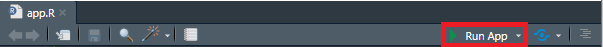
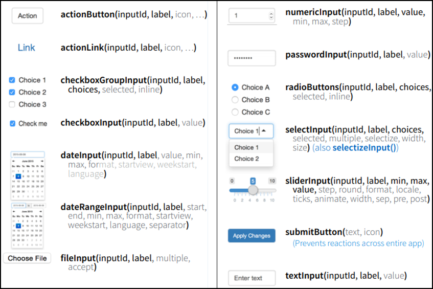
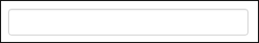
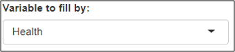
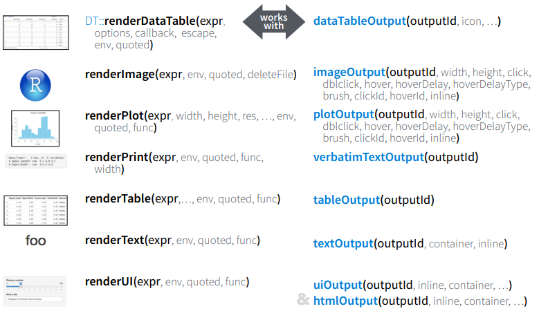

```{r setup, include=FALSE}
options(htmltools.dir.version = FALSE)
library(countdown)
library(tidyverse)
library(shiny)
library(kableExtra)
library(BristolVis)
library(printr)
library(ggthemes)
library(tufte)
knitr::opts_chunk$set(warning = F, message = F)
knitr::opts_chunk$set(fig.height = 8, out.width = "100%", comment = " ", cache = F, dpi = 700)

source("https://raw.githubusercontent.com/EvaMaeRey/little_flipbooks_library/master/xaringan_reveal_parentheses_balanced.R")

source(file = "xaringan_reveal_parenthetical.R")
```


# A brief intro to advanced topics


## - Create beautiful plots with `ggplot`


--


## - Build interactive apps with `shiny`


--

## - Share your work as a package


---

# Public Service Announcement
.Large[
__I pronounce the letter "R" oddly:__
]

.center[

.col-left[
  
R  
("oar")
]

.col-right[
   
R  
("arr")
]
<br>
<br>
<br>
.col-center[.Large[.bold[means]]]
]
<br>
<br>
<br>
<br>
<br>
<br>

---

class: inverse, middle, center

# Pretty plots: <br> Intro to `ggplot2`

---

# ggplot2

.Large[

A package to create highly customisable publication-ready plots

Key points:

* .bold[aesthetic]: what you want to graph (e.g. x, y, colours, etc)

* .bold[geom]: how you want to graph it (e.g. scatterplot, histogram)

* .bold[options]: optional titles, themes, etc.

]

---

## .yt[The `bmi2` dataset]
.large[
The dataset used for following graphics contains 200 observations across the following six variables:
]

```{r, echo=FALSE, width = 800}

bmi2 <- tibble::tribble(
  ~id,  ~age,  ~bmi,      ~sex,    ~diet,         ~status,
   1, 78.2, 29.3,   "Male", "Good", "Unhealthy",
   2, 48.5,   33, "Female", "Good", "Unhealthy",
   3, 79.5, 31.5, "Female", "Good", "Unhealthy",
   4, 78.5, 28.1,   "Male", "Poor",   "Healthy"
  )

kable(head(bmi2[1:4,]),row.names = FALSE)
```

Install and load `ggplot2`, and download a copy of the dataset to follow along:

```{r, eval = FALSE}
install.packages("ggplot2")
library("ggplot2")

df <- read.csv("http://bit.ly/phd-intro-bmi2")
```


---

```{r, echo = F}
df <- BristolVis::bmi2
```

```{r christmas, eval=F, echo=F}
ggplot(data = df) +
aes(x = age) +
aes(y = bmi) +
geom_point() +
aes(colour = sex) +
geom_smooth(method = "lm", se = F) +
scale_color_manual(values = 
                     c("blue", "purple")) +
ylim(c(15, 35)) +
labs(colour = "") +
labs(title = "BMI by Age") +
labs(subtitle = "Colour indicates sex") +
theme_bw() +
theme_void() +
theme_classic() +
theme_economist()
```

```{r, echo = F, warning=F, message=F, eval = T, fig.show='hide'}
get_what_save_what <- "christmas"
eval(parse(text = paste(knitr:::knit_code$get(get_what_save_what), collapse = "")))
ggsave(paste0("figures/", get_what_save_what, ".png"), dpi = 700)
```


`r apply_reveal("christmas")`

???

Make sure to copy these into a new R file.

Key concept is that you are adding pieces together

- first the data 

- then the elements of the data you want to display 

- then the way you want to display them

- then how you want to colour them

- then extra options

---

```{r christmas2, eval=F, echo=F}
ggplot(data = df) +
aes(x = status) +
geom_histogram(stat = "count") +
aes(fill = diet) +
labs(fill = "") +
labs(title = "Number of people by status") +
labs(subtitle = "Colour indicates diet") +
xlab("Status") +
ylab("Number of people") +
theme(axis.title=element_text(colour="red"))+
theme(legend.position = "bottom") +
theme(panel.grid = element_blank()) +
theme(panel.background=element_rect(fill="black")) +
theme(legend.position = "top") 

```

```{r, echo = F, warning=F, message=F, eval = T, fig.show='hide'}
get_what_save_what <- "christmas2"
eval(parse(text = paste(knitr:::knit_code$get(get_what_save_what), collapse = "")))
ggsave(paste0("figures/", get_what_save_what, ".png"), dpi = 700)
```


`r apply_reveal("christmas2")`

---

```{r christmas3, eval=F, echo=F}
ggplot(data = df) +
aes(x = age) +
aes(y = bmi) +
geom_point() +
aes(colour = sex) +
geom_smooth(method = "lm", se = F) +
facet_grid(diet ~ .) +
facet_grid(. ~ diet)
```

```{r, echo = F, warning=F, message=F, eval = T, fig.show='hide'}
get_what_save_what <- "christmas3"
eval(parse(text = paste(knitr:::knit_code$get(get_what_save_what), collapse = "")))
ggsave(paste0("figures/", get_what_save_what, ".png"), dpi = 700)
```

`r apply_reveal("christmas3")`

---

# Virtually endless customisability

.Large[

Plots on previous slides are only a taster

Can make any plot you can think up

Key resources, both open-source:

* [`ggplot2` cheatsheet](https://ggplot2.tidyverse.org/)

* ["Data visualisation"](https://socviz.co/) by Kieran Healy

]

---

class: inverse, middle, center

# Making R accessible: <br> Intro to `shiny`

---

## What is .cb[`shiny`]?
.Large[
.cb[`shiny`] is an R package that allows users to build interactive web applications ("apps") straight from R.

.pull-left[
"Apps" are webpages that users can interact with to: 

* Explore data

* Perform analyses

* Create plots
]
]

.pull-right[
<br>
.center[

]
]

---

## Demo of a basic .cb[`shiny`] app

<iframe src="https://mcguinlu.shinyapps.io/shiny-teaching-apps/" class="foo" width="1400"  height="475" scrolling="no" frameBorder="0"></iframe>

---

class: inverse, middle, center

# Introduction: <br> Structure of a `shiny` R file

---

# .yt[Run your own app ]

.Large[

Visit the URL below and copy and paste the code there into a new R file:

> http://bit.ly/phd-intro-app

Save the file as "app.R" then start the app either by:

* click the "Run App" button:

.center[]

* or use the keyboard short-cut: _Ctrl/Command+Shift+Enter_

]

---

## Structure of a .cb[`shiny`] app

.Large[

A .cb[`shiny`] app is a special type of `R` file that has three component:

* .Large[.bold[User interface]]]
  
--

* .Large[.Large[.bold[Server]]]

--

* .Large[.Large[.bold[Call to the .cb[`shinyApp`] function]]]


???

User interface
  * Defines the layout of your app
  * Controls what it looks like (themes/fonts/etc)

Server
  * Defines the logic needed to build the app
  * Performs computational work 

---

## How it works

.Large[.bold[Using webpage rather than command line to instruct R]]

.center[

]

---

exclude: false

## *app.R*

.Large[
__User interface container__
]

``` {r, eval = FALSE}
# USER INTERFACE
ui <- fluidPage(  #<<
      . . .
)  #<<


# SERVER
|
| 
|

# RUN THE APP
|      
```


---

exclude: false

## *app.R*


.Large[
__Server function__
]

``` {r, eval = FALSE}
# USER INTERFACE
ui <- fluidPage( 
      . . .
) 


# SERVER
server <- function(input, output) { #<<
      . . .
} #<<

# RUN THE APP
|

```

---

## *app.R*

.Large[
__Call to the .cb[`shinyApp`] function__
]

``` {r, eval = FALSE}
# USER INTERFACE
ui <- fluidPage(
      . . .
)


# SERVER
server <- function(input, output) { 
      . . .
} 

# RUN THE APP
shinyApp(ui = ui, server = server) #<<
 
```

---

class: inverse, center, middle

# Capturing inputs: Control widgets

---

## A widget for every occasion

Control widgets are used to capture user input and vary based on type of input:

.center[



Image sourced from the .cb[`shiny`] Rstudio [cheatsheet](https://shiny.rstudio.com/images/shiny-cheatsheet.pdf)
]

---

## The anatomy of a widget

All control widgets have two elements in common:

* __inputId__: Unique ID for that widget

* __label__: Text to be displayed beside the widget (which can be left blank)

```{r, eval =FALSE}
textInput(inputId = "textboxinput",
          label = "") 
```

.center[

]

Other elements are specific to the widget you are using:

```{r, eval=FALSE}
selectInput(inputId = "fillby",
            label = "Variable to fill by",
            choices = c("Health","diet")),

```

.center[

]

---

class: inverse, center, middle

# Creating your own app: <br> Reactive outputs

---

## Creating reactive outputs 

.small[
``` {r, eval = FALSE}
# Define UI
ui <- fluidPage(
  textInput(inputId = "textboxinput", #<<
            label = ""), #<<
  textOutput("textout")
)

# Define server
server <- function(input, output) {

    output$textout <- renderText({ 
        input$textboxinput 
    }) 
}

# Run the application 
shinyApp(ui = ui, server = server)

```


Three steps:

* Capture the user input using a .cb[`*Input()`] function
]

---


## Creating reactive outputs

.small[
``` {r, eval = FALSE}
# Define UI
ui <- fluidPage(
  textInput(inputId = "textboxinput",
            label = ""),
  textOutput("textout")
)

# Define server
server <- function(input, output) {

    output$textout <- renderText({ #<<
        input$textboxinput #<<
    }) #<<
}

# Run the application 
shinyApp(ui = ui, server = server)

```


Three steps:

* Capture the user input using a .cb[`*Input()`] function

* Add the code to render the object to the server function using a .cb[`render*()`] function

]

---

## Creating reactive outputs

.small[
``` {r, eval = FALSE}
# Define UI 
ui <- fluidPage(
    textInput(inputId = "textboxinput",
            label = ""),
  textOutput("textout") #<<
)

# Define server
server <- function(input, output) {

    output$textout <- renderText({
        input$textboxinput
    })
}

# Run the application 
shinyApp(ui = ui, server = server)

```


Three steps:

* Capture the user input using a .cb[`*Input()`] function

* Add the code to render the object to the server function using a .cb[`render*()`] function

* Add the resulting object to the user interface using the corresponding .cb[`*Output()`] function.

]

---

## Rendering the output

Similar to inputs, there are different .cb[`render\*()`]/.cb[`*Output()`] function pairs for different types of output:


.center[


Image sourced from the .cb[`shiny`] Rstudio [cheatsheet](https://shiny.rstudio.com/images/shiny-cheatsheet.pdf)

]

---

## Accessing widget values

The inputId of the widget is important

For the following widget:

```{r, eval = FALSE}
textInput(inputId = `"textboxinput"`,
          label = "")
```

its value is defined by 

```{r eval= FALSE}
input$`textboxinput`
```

???

shiny stores all userdefined information in a list-like object called "input"

---

## Using the value of the control widgets
.small[
**renderPlot() function in the server**
```{r eval=FALSE}
output$barPlot <- renderPlot({
       ggplot(data = med, aes_string(fill = `input$fill`)) +
          geom_histogram(aes(x = status), stat = "count")
       })
```
]

<hr>

--

.small[
.pull-left[
**Changes based on value selected by user in UI**

When *input$fill = health*:
]

.pull-right[

]


```{r eval=FALSE}
ggplot(data = med, aes_string(fill = "health")) +
   geom_histogram(aes(x = status), stat = "count")
```
]

--

.small[
<br>
When *input$fill = treatment*:

```{r eval=FALSE}
ggplot(data = med, aes_string(fill = "treatment")) +
   geom_histogram(aes(x = status), stat = "count") 
```
]


---

# Further customising your app

.large[
The most common tags have wrapper functions to make them easier to use:
]

``` {r, eval=FALSE}
ui <- fluidPage(         
 h1("Header 1"),              # header (can be h1-h6)
 hr(),                        # horizontal rule
 br(),                        # line break
 p("Text"),                   # paragraph text
 p(strong("bold")),           # bold
 p(em("italic")),             # italics         
 p(code("code")),             # code highlighting         
 a(href="", "link"),          # Hyperlink            
 HTML("<p>Raw html</p>")      # Raw html                
)    
```

.large[
Some tags, e.g. .cb[em()] and .cb[strong()] must be nested within a paragraph tag, .cb[p()]

Similar to the control widgets, all tags are followed by a comma, except for the last element in the user interface container

A full list of tags is available on the .cb[`shiny`] Rstudio [cheatsheet](https://shiny.rstudio.com/images/shiny-cheatsheet.pdf)

]

--- 

# Publishing your app

.Large[

Currently only you can access your app

To publish online for free:

* Ensure that your app.R file is contained within its own folder

* Go to [shinyapps.io](https://www.shinyapps.io/)

* Follow the instructions there to publish your app

]

---

class: inverse, middle, center

# Packaging your code

---

# Why package

.Large[

<blockquote class="twitter-tweet"><p lang="en" dir="ltr">&quot;I wish I&#39;d left this code across scattered .R files instead of combining it into a package&quot; said no one ever <a href="https://twitter.com/hashtag/rstats?src=hash&amp;ref_src=twsrc%5Etfw">#rstats</a> <a href="http://t.co/udeNH4T67H">http://t.co/udeNH4T67H</a></p>&mdash; David Robinson (@drob) <a href="https://twitter.com/drob/status/611885584584441856?ref_src=twsrc%5Etfw">June 19, 2015</a></blockquote> <script async src="https://platform.twitter.com/widgets.js" charset="utf-8"></script>

<br>

Benefits:

* Reliable and universal way to share code/data

* Are citable, via services like Zenodo

* Well developed testing framework

]

???

Even if you hate your fellow scientists and don't want to share your code, still good to package - future you will appreciate it! 

---

# Package repositories

.Large[

**Cran**

* Official repository  
* Strict submission process to guarantee quality
* `install.packages("pacakgename")`

**Bioconductor**

* Topic specific repository, with a focus on bioinformatics  
* Strict submission requirements, similar to CRAN
* `BiocManager::install("GenomicFeatures")`

**GitHub**

* Popular for open source projects  
* Wild west of packages
* `devtools::install_github("username/packagename")`

]

---

# Resources

.Large[

[*R Packages*](http://r-pkgs.had.co.nz/) by Hadley Wickham

[*Writing an R package from scratch*](hilaryparker.com/2014/04/29/writing-an-r-package-from-scratch/) by Hilary Parker

]

---

## Wrapping up

Please do get in touch if we can be of help:


* Email: [luke.mcguinness@bristol.ac.uk](mailto:luke.mcguinness@bristol.ac.uk)  
* Twitter: [@mcguinlu](https://twitter.com/mcguinlu)  
* GitHub: [@mcguinlu](https://github.com/mcguinlu)  

* Email: [matthew.lee@bristol.ac.uk](mailto:matthew.lee@bristol.ac.uk)  
* Twitter: [@Science_Matt](https://twitter.com/Science_Matt)  
* GitHub: [@mattlee821](https://github.com/mattlee821)  

---


## Image credits
Oar: By Florian Pépellin - Own work, CC BY-SA 3.0, https://commons.wikimedia.org/w/index.php?curid=43042720