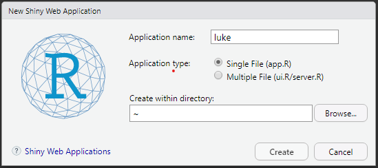

```{r setup, include=FALSE}
options(htmltools.dir.version = FALSE)
library(countdown)
library(shiny)
```

# What you need to do now:

* Open RStudio

* Install `shiny`

``` {r, eval=FALSE}
  install.packages("shiny")
  library(shiny)
```

* Open a new `shiny` file

  * _File -> New File -> Shiny Web App..._

* Pick a name (maybe your own?) and chose the single file option

.center[

]


---

# Session plan

1-2 => Lecture

2-2:30 => Coffee

2.30:4 => Practical
