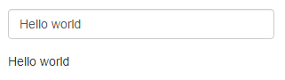

```{r setup, include=FALSE}
options(htmltools.dir.version = FALSE)
library(countdown)
library(shiny)
```

# Overview of this session

- Background to `shiny`

--

- Demonstration of a simple `shiny` app

--

- Creating your own app

  - User interface and control widgets

  - Outputs

  - Execution

--

- Advanced usage

  - Reactive programming

  - Share/publish your app

--

- Tips and tricks

---

# Public service announcements

I pronounce the letter R oddly:  


.center[

.col-left[
  
R  
("oar")
]

.col-right[
   
R  
("arr")
]
<br>
<br>
<br>
.col-center[.Large[.bold[means]]]
]
<br>
<br>
<br>
<br>
<br>
<br>

__Please__ ask questions as we go along!

We will be using timers as part of this course:


`r countdown(minutes=0.25, warn_when = 10, play_sound=TRUE, right = "34%" )`

---

class: inverse, middle, center

# Introduction: <br> Background to `shiny`

---
## What is .cb[`shiny`]?

.cb[`shiny`] is an R package build interactive web applications ("apps") straight from R.

<br>

.center[

]

---

## Why is it called .cb[`shiny`]?

.pull-left[
**Likely (but less interesing) reason**

Allows you “*to build beautiful, responsive, and powerful applications with minimal effort.*”]

--

.pull-right[
**Unlikely (but more interesing) reason**

Speculation that it comes from the show *Firefly*, in which “shiny” means “good” or “valuable”.]

--

<br>

.center[


]

---

## Benefits of .cb[`shiny`] for visualisation


<iframe src="https://mcguinlu.shinyapps.io/shiny-teaching-apps/" class="foo" width="1400"  height="450" scrolling="no" frameBorder="0"></iframe>


_Data shown is from the `med` dataset used throughout this course_


---

class: inverse, middle, center

# Introduction: <br> Structure of a `shiny` app

---

## Structure of a .cb[`shiny`] app

A .cb[`shiny`] has three components:

* .large[.bold[User interface]]

  * Defines the layout of your app
  * Controls what it looks like (themes/fonts/etc)
  

* .large[.bold[Server]]

  * Defines the logic needed to build the app
  * Performs computational work 
  

* .large[.bold[Call to the .cb[`shinyApp`] function]]

  * Creates the app from an user interface and server pair


---

class: inverse, center, middle

# Creating your own app: <br> Getting started

---

exclude: false

## Setting up a `shiny` app


This _ui/server_ structure can be implemented in two ways:

<br>

--

.pull-left[
.center[
.bold[
.large[
Option 1
]
]

A single file called app.R

]
]

--

.pull-right[
.center[
.bold[
.large[
Option 2
]
]

Two seperate files called ui.R and server.R

]
]

--
.center[
.pull-left[
.red[
.bolder[^]

This is the structure we will use.
]
]
]


---

exclude: false

## A single file .cb[`shiny`] app: *app.R*

.Large[
__User interface container__
]

``` {r, eval = FALSE}
# USER INTERFACE
ui <- fluidPage(  #<<
      . . .
)  #<<


# SERVER
|
| 
|

# RUN THE APP
|      
```


---

exclude: false

## A single file .cb[`shiny`] app: *app.R*


.Large[
__Server function__
]

``` {r, eval = FALSE}
# USER INTERFACE
ui <- fluidPage( 
      . . .
) 


# SERVER
server <- function(input, output) { #<<
      . . .
} #<<

# RUN THE APP
|

```

---

## A single file .cb[`shiny`] app: *app.R*


.Large[
__Call to the .cb[`shinyApp`] function__
]

``` {r, eval = FALSE}
# USER INTERFACE
ui <- fluidPage(
      . . .
)


# SERVER
server <- function(input, output) { 
      . . .
} 

# RUN THE APP
shinyApp(ui = ui, server = server) #<<
 
```

---

## Option 2: a two-file approach
__Create new folder named "app_directory" with two files:__

``` {r, eval = FALSE}
~/app_directory
|-- ui.R
|-- server.R
```

<hr>

__The files will contain the relevant functions:__
.pull-left[
``` {r, eval = FALSE}
ui<-fluidPage( 
      . . .
) 
```
.center[*ui.R*]]

.pull-right[
``` {r, eval = FALSE}
server<-function(input,output){
      . . .
}
```
.center[*server.R*]]

<hr>

__Then run the app using:__

``` {r, eval = FALSE}
runApp("app_directory")
```


???

Single file apps have the advantage of being able to run from the console -> easy to share

Multi file apps can open the ui/server seperately and have them open simultaneously in the editor -> makes it easy to match inputs and outputs

---

## Running your app

.large[.bold[There are two options when running your app:]]


Open the app by running .cb[`runApp("app-dir")`] in the console, where "app-dir" is the name of the directory containing your app.R script: 

```{r, eval=FALSE}
runApp("luke")
```

.center[
.bold[
.large[
OR
]
]
]

Open the app.R script in Rstudio and then:

* click the "Run App" button:

.center[]

* Use the keyboard short-cut: _Ctrl/Command+Shift+Enter_


---

## .yt[Your Turn: Run your first app]

Open "Example1.R"

Run it:

* from the console, 
* using the "Run App" button

Identify the three component parts of the app


`r countdown(minutes = 3, play_sound=TRUE, warn_when = 30)` 

---

class: inverse, center, middle

# Creating your own app: <br> User interface

---

## Shiny: inputs and outputs

Shiny is basically a series of inputs and outputs

* Inputs:  information from user interface => server

* Outputs: information from server => user interface

.center[

]

.tiny[
``` {r, eval = FALSE}
# Define UI for application that draws a histogram
ui <- fluidPage(

textInput("textin", label = ""),
textOutput("textout")

)

# Define server logic required to draw a histogram
server <- function(input, output) {

    output$textout <- renderText({
        input$textin
    })
}

# Run the application 
shinyApp(ui = ui, server = server)

```
]

---

## .small[Code for demo app]

``` {r, eval = FALSE}
library(BristolVis)
library(ggplot2)

ui <- fluidPage(
   
      shiny::selectInput(inputId = "fill",
                         label = "Variable to fill by:",
                         choices = c("health",
                                     "treatment")),
      plotOutput("barPlot")
)

server <- function(input, output) {
   output$barPlot <- renderPlot({
      ggplot(data = med, aes_string(fill = input$fill)) +
         geom_histogram(aes(x = status), stat = "count") +
         labs(fill = "Fill")
      })
}

shinyApp(ui = ui, server = server)

```

---

## .cb[`sidebarLayout()`]

Common layout for .cb[`shiny`] apps

Defined as:

``` {r, eval = FALSE}
sidebarLayout(
  titlePanel(),
  sidebarPanel(
    # Control widgets
  ),
  mainPanel(
    # Outputs
  )
)
```

The sidebarPanel is usually used to house the control widgets that capture user input.

The mainPanel is usually used to present the output of the app (text/graph/results).

We will follow this convention here.


---

class: inverse, center, middle

# Creating your own app: <br> Control widgets

---

## A widget for every occasion

Control widgets are used to capture user input and vary based on type of input:

.center[


Image sourced from the .cb[`shiny`] Rstudio [cheatsheet](https://shiny.rstudio.com/images/shiny-cheatsheet.pdf)
]

---

## The anatomy of a widget

All control widgets have two elements in common:

* __inputId__: Unique ID for that widget

* __label__: Text to be displayed beside the widget (which can be left blank)

```{r, eval =FALSE}
textInput(inputId = "textboxinput",
          label = "") 
```

.center[

]

Other elements are specific to the widget you are using:

```{r, eval=FALSE}
selectInput(inputId = "fillby",
            label = "Variable to fill by",
            choices = c("Health","treament")),

```

.center[

]

---

# Accessing widget values

The inputId of the widget is important

Remember the server function:

```{r, eval = FALSE}
server <- function(`input`, output) {
  . . . 
}

```

--
<hr>

For the following widget:

```{r, eval = FALSE}
# Define
textInput(inputId = `"textboxinput"`,
          label = "")
```

its value is defined by 

```{r eval= FALSE}
input$`textboxinput`
```

???

shiny stores all userdefined information in a list-like object called "input"

The value from a specific widget can then be accessed using the value of it's inputID:
---

class: inverse, center, middle

# Creating your own app: <br> Rendering outputs

---

## Rendering outputs - the basics


---

## Using the value of the control widgets
.small[
**renderPlot() function in the server**
```{r eval=FALSE}
output$barPlot <- renderPlot({
       ggplot(data = med, aes_string(fill = `input$fill`)) +
          geom_histogram(aes(x = status), stat = "count") +
          labs(fill = "Fill")
       })
```
]
<hr>

--

.small[
**Changes based on value selected by user in UI**

When *input$histogram_fill = health*:

```{r eval=FALSE}
ggplot(data = med, aes_string(fill = `health`)) +
   geom_histogram(aes(x = status), stat = "count") +
   labs(fill = "Fill")
```
]

--
.small[
<br>
When *input$fill = treatment*:

```{r eval=FALSE}
ggplot(data = med, aes_string(fill = `treatment`)) +
   geom_histogram(aes(x = status), stat = "count") +
   labs(fill = "Fill")
```
]


---

class: inverse, center, middle

# Getting more from `shiny`: <br> Execution

---
class: inverse, center, middle

# Getting more from `shiny`: <br> Page layout

---

class: test

## Fluid page layout

.center[


.pull-right[
Image by Hadley Wickham
]

]

---

class: inverse, center, middle

# Getting more from `shiny`: <br> Making shiny sparkle


---

class: inverse, center, middle

# Getting more from `shiny`: <br> Reactive programming

---

# Shiny is reactive . . . 

---

# but in a lazy way

Updating the `fill` option doesn't force the title to change:

---

## .yt[Your Turn: Try a reactive expression]

---

class: inverse, center, middle

# Getting more from `shiny`: <br> Sharing/publishing your app

---

## .yt[Your Turn: Publish your app]

---

class: inverse, center, middle

# Tips and tricks

---

# Inputs
**Basic function**
```{r eval=FALSE}
output$histogram <- renderPlot({#<<
|  
|  
  })#<<

```

---

## Images
Oar: By Florian Pépellin - Own work, CC BY-SA 3.0, https://commons.wikimedia.org/w/index.php?curid=43042720

Pirate: 