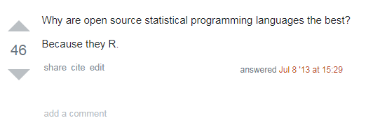
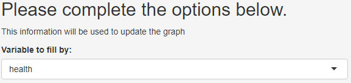

```{r setup, include=FALSE}
options(htmltools.dir.version = FALSE)
library(countdown)
library(shiny)
library(kableExtra)
library(BristolVis)
```

# Overview of this session

- Background to .cb[`shiny`]

--

- Creating your own app

  - Set-up

  - User interface & control widgets

  - Outputs

--

- Getting more from .cb[`shiny`]

  - Execution
    
  - Customising your app
  
  - Reactive programming
  
  - Publishing your app

---

# Public Service Announcements

.Large[
__Workshop plan__
]
.large[
* Lecture and six short  practicals mixed together
* There will be a break for coffee in the middle
]

<br>

--

.Large[
__Please ask questions as we go along, and feel free to chat/compare code with your neighbours__
]
<br>

--

.Large[
__We will be using timers as part of this course:__
]

`r countdown(minutes =0, seconds=15, warn_when = 10, play_sound=TRUE, right = "34%" )`

---

# Public Service Announcements
.Large[
__I pronounce the letter "R" oddly:__
]

.center[

.col-left[
  
R  
("oar")
]

.col-right[
   
R  
("arr")
]
<br>
<br>
<br>
.col-center[.Large[.bold[means]]]
]
<br>
<br>
<br>
<br>
<br>
<br>

--

.center[

]

---

class: inverse, middle, center

# Introduction: <br> Background to `shiny`

---
## What is .cb[`shiny`]?

.cb[`shiny`] is an R package that allows users to build interactive web applications ("apps") straight from R.

<br>

.center[

]

---

## Why is it called .cb[`shiny`]?

.pull-left[
**Likely (but less interesing) reason**

Allows you “*to build beautiful, responsive, and powerful applications with minimal effort.*”]

--

.pull-right[
**Unlikely (but more interesing) reason**

Speculation that it comes from the show *Firefly*, in which “shiny” means “good” or “valuable”.]

<br>

.center[


]

---

## Benefits of .cb[`shiny`] for visualisation


<iframe src="https://mcguinlu.shinyapps.io/shiny-teaching-apps/" class="foo" width="1400"  height="475" scrolling="no" frameBorder="0"></iframe>

.small[
_Data shown is from the `med` dataset used throughout this course_
]

---

class: inverse, middle, center

# Introduction: <br> Structure of a `shiny` app

---

## Structure of a .cb[`shiny`] app

A .cb[`shiny`] app has three components:

* .large[.bold[User interface]]

  * Defines the layout of your app
  * Controls what it looks like (themes/fonts/etc)
  
--

* .large[.bold[Server]]

  * Defines the logic needed to build the app
  * Performs computational work 
  
--

* .large[.bold[Call to the .cb[`shinyApp`] function]]

  * Creates the app from an user interface and server pair


---

## Inputs and outputs

Information moves between the UI and the server via inputs and outputs

NB: No computation takes place in UI - only the server can run R functions

.center[

]

---

class: inverse, center, middle

# Creating your own app: <br> Getting started

---

exclude: false

## Setting up a .cb[`shiny`] app

.Large[
This _ui/server_ structure can be implemented in two ways:
]

--

.pull-left[
.Large[
.center[
.bold[
Option 1
]
A single file called app.R]]]
--

.pull-right[
.Large[
.center[
.bold[
Option 2
]
Two files: ui.R and server.R]]]

--
.Large[.center[.pull-left[.red[.bolder[
<span style='font-size:100px;'>&#8593;</span>  

This is the structure  
we will use.
]
]
]
]
]

---

exclude: false

## Option 1: single file (*app.R*)

.Large[
__User interface container__
]

``` {r, eval = FALSE}
# USER INTERFACE
ui <- fluidPage(  #<<
      . . .
)  #<<


# SERVER
|
| 
|

# RUN THE APP
|      
```


---

exclude: false

## Option 1: single file (*app.R*)


.Large[
__Server function__
]

``` {r, eval = FALSE}
# USER INTERFACE
ui <- fluidPage( 
      . . .
) 


# SERVER
server <- function(input, output) { #<<
      . . .
} #<<

# RUN THE APP
|

```

---

## Option 1: single file (*app.R*)


.Large[
__Call to the .cb[`shinyApp`] function__
]

``` {r, eval = FALSE}
# USER INTERFACE
ui <- fluidPage(
      . . .
)


# SERVER
server <- function(input, output) { 
      . . .
} 

# RUN THE APP
shinyApp(ui = ui, server = server) #<<
 
```

---

## Option 2: two-file approach
__Create new folder named "app_directory" with two files:__

``` {r, eval = FALSE}
~/app_directory
|-- ui.R
|-- server.R
```

<hr>

__The files will contain the relevant functions:__
.pull-left[
``` {r, eval = FALSE}
ui<-fluidPage( 
      . . .
) 
```
.center[*ui.R*]]

.pull-right[
``` {r, eval = FALSE}
server<-function(input,output){
      . . .
}
```
.center[*server.R*]]

<hr>

__Then run the app using:__

``` {r, eval = FALSE}
runApp("app_directory")
```


???

Single file apps have the advantage of being able to run from the console -> easy to share.

If using multi-file apps, you can open the ui/server seperately and have them open simultaneously in the editor -> makes it easy to match inputs and outputs

---

## Running your app

.large[.bold[There are two options when running your app:]]


Open the app by running .cb[`runApp("app-dir")`] in the console, where "app-dir" is the name of the directory containing your app.R script: 

```{r, eval=FALSE}
runApp("luke")
```

.center[
.bold[
.large[
OR
]
]
]

Open the app.R script in Rstudio and then:

* click the "Run App" button:

.center[]

* Use the keyboard short-cut: _Ctrl/Command+Shift+Enter_

---

## .yt[Your Turn: Introducing the data]
.large[
The dataset we will use for the practical elements is the .cb[`bmi2`] dataset included with the BristolVis package:
]

```{r, echo=FALSE, width = 800}

bmi2 <- tibble::tribble(
  ~id,  ~age,  ~bmi,      ~sex,    ~diet,         ~status,
   1, 78.2, 29.3,   "Male", "Good", "Unhealthy",
   2, 48.5,   33, "Female", "Good", "Unhealthy",
   3, 79.5, 31.5, "Female", "Good", "Unhealthy",
   4, 78.5, 28.1,   "Male", "Poor",   "Healthy"
  )

kable(head(bmi2[1:4,]),row.names = FALSE)
```

.large[
The data set contains 200 observations across the following six variables:

.pull-left[
__Continuous variables:__

* id
* age
* bmi

]

.pull-right[
__Categorical variables:__

* sex: Male / Female
* diet: Good / Moderate / Poor
* status: Healthy / Unhealthy

]
]


---

## .yt[Your Turn: Run your first app]


.Large[
* Open the "prac1_shiny" vignette, and copy the code into an empty R file
]

```{r,eval=FALSE}
    vignette("prac1_shiny", package = "BristolVis")
```

.Large[
* Run it both:

  * from the console (note: you'll have to save it first)
  * using the "Run App" button

]

`r countdown(minutes = 5, play_sound=TRUE, warn_when = 30)` 

---

class: inverse, center, middle

# Creating your own app: <br> User interface & <br> control widgets

---

## .cb[`sidebarLayout()`]

Common layout for .cb[`shiny`] apps

.center[


]


---

## .cb[`sidebarLayout()`]

Defined in code as:

``` {r, eval = FALSE}
ui <- fluidPage( 
  sidebarLayout(
    sidebarPanel(
      # Control widgets and HTML objects
    ),
    mainPanel(
      # Outputs
    )
  )
)
```


Conventions for use:
* The .cb[`sidebarPanel`] is usually used to house the control widgets that capture user input.

* The .cb[`mainPanel`] is usually used to present the output of the app (text/graph/results).

---

## Example of the sidebarLayout()

.center[

]

---

## A widget for every occasion

Control widgets are used to capture user input and vary based on type of input:

.center[


Image sourced from the .cb[`shiny`] Rstudio [cheatsheet](https://shiny.rstudio.com/images/shiny-cheatsheet.pdf)
]

---

## The anatomy of a widget

All control widgets have two elements in common:

* __inputId__: Unique ID for that widget

* __label__: Text to be displayed beside the widget (which can be left blank)

```{r, eval =FALSE}
textInput(inputId = "textboxinput",
          label = "") 
```

.center[

]

Other elements are specific to the widget you are using:

```{r, eval=FALSE}
selectInput(inputId = "fillby",
            label = "Variable to fill by",
            choices = c("Health","treament")),

```

.center[

]

---

## A note on commas in the user interface

.Large[
Remember that the UI containers (e.g. .cb[`mainPanel()`]) are still functions, to which arguments (i.e. widgets) are passed, so normal rules apply when using commas
]


---

## .yt[Your Turn: Design a user interface]
* Open the "prac1_shiny" vignette, and copy the code into an empty R file


```{r,eval=FALSE}
  vignette("prac1_shiny", package = "BristolVis")
```

* Identify the elements of .cb[`sidebarLayout`]

* Run the app

* Make the following changes:
  * Change the title of the app to "Demo of a shiny app"
  * Add a new selectInput widget to the sidebar, with the options "sex","diet", and "status"
  * Add a new textInput widget to the sidebar with the label "Plot title:"
  
* What is the value of .cb[`input$textbox`] when the following is entered in it?  
_This is a test_    

`r countdown(minutes = 10, play_sound=TRUE, warn_when = 30)`

???

Last question is important demonstration of how text is saved to input$<id>


---


class: inverse, center, middle

# Creating your own app: <br> Reactive outputs

---

## Creating outputs - the basics

.small[
``` {r, eval = FALSE}
# Define UI
ui <- fluidPage(
  textOutput("textout")
)

# Define server
server <- function(input, output) {

    output$textout <- renderText({ #<<
        "This is the best app ever!" #<<
    }) #<<
}

# Run the application 
shinyApp(ui = ui, server = server)

```
]

Two steps:

* Add the code to render the object to the server function using a .cb[`render*()`] function

---

## Creating outputs - the basics

.small[
``` {r, eval = FALSE}
# Define UI 
ui <- fluidPage(
  textOutput("textout") #<<
)

# Define server
server <- function(input, output) {

    output$textout <- renderText({
        "This is the best app ever!"
    })
}

# Run the application 
shinyApp(ui = ui, server = server)

```
]

Two steps:

* Add the code to render the object to the server function using a .cb[`render*()`] function

* Add the resulting object to the user interface using the corresponding .cb[`*Output()`] function.
---

## Rendering the output

Similar to inputs, there are different .cb[`render\*()`]/.cb[`*Output()`] function pairs for different types of output:


.center[


Image sourced from the .cb[`shiny`] Rstudio [cheatsheet](https://shiny.rstudio.com/images/shiny-cheatsheet.pdf)

]

---

## Static vs reactive outputs

.Large[

So far, the graphical outputs we have created are not fully reactive

Remember in the last practical, changing the value of the selectInput widget from "sex" to "diet" had no effect

Reactive outputs are those that make use of the value of a control widget

]

---

## Accessing widget values

The inputId of the widget is important

Remember the server function:

```{r, eval = FALSE}
server <- function(`input`, output) {
  . . . 
}

```

Reads in a list-like object containing the value of each widget, identified by its inputId

--
<hr>

For the following widget:

```{r, eval = FALSE}
textInput(inputId = `"textboxinput"`,
          label = "")
```

its value is defined by 

```{r eval= FALSE}
input$`textboxinput`
```

???

shiny stores all userdefined information in a list-like object called "input"

---
## Using the value of the control widgets

.center[

]

---


## Using the value of the control widgets
.small[
**renderPlot() function in the server**
```{r eval=FALSE}
output$barPlot <- renderPlot({
       ggplot(data = med, aes_string(fill = `input$fill`)) +
          geom_histogram(aes(x = status), stat = "count")
       })
```
]

<hr>

--

.small[
**Changes based on value selected by user in UI**

When *input$fill = health*:

```{r eval=FALSE}
ggplot(data = med, aes_string(fill = `"health"`)) +
   geom_histogram(aes(x = status), stat = "count")
```
]

--

.small[
<br>
When *input$fill = treatment*:

```{r eval=FALSE}
ggplot(data = med, aes_string(fill = `"treatment"`)) +
   geom_histogram(aes(x = status), stat = "count") 
```
]

---

## . . . and .cb[`switch`]!

.large[
In the previous example, we used the aes_string() function to get around the fact that the value of .cb[`input$fill`] was in quotes

The .cb[`switch`] function converts the value of .cb[`input$<id>`] from a .cb[`selectInput()`] box into anything you like. 
]

```{r, eval=FALSE}

server <- function(input, output) {
  
 output$barPlot <- renderPlot({
    
    fill <- switch(input$fill, #<<
                     "treatment" = med$treatment, #<<
                     "health" = med$health) #<<
    
    ggplot(data = med, `aes`(fill = `fill`)) +
      geom_histogram(aes(x = status), stat = "count") 
    
  })
}

```

---

## A comment on brackets

.Large[

Note the difference between:

```{r, eval=FALSE}
renderPlot(`{}`) 

renderPlot()
```

Whenever you have a function argument that's more than just a single expression, you need to use curly braces

Good practice to use .cb[{}] all the time, so that you don't get errors
]


---

## .yt[Your Turn: Create reactive content]

* Open the "prac2_shiny" vignette, and copy the code into an empty R file

```{r,eval=FALSE}

  vignette("prac2_shiny", package = "BristolVis")

```

* Run the app to familarise yourself with it

* Examine the code used to produce the table in the UI/server
  * Why is the table not being displayed in the app?
  * Fix the code in the UI so that the table is displayed in the .cb[`mainPanel`]

* Examine the code used to produce the plot in the UI/server
  * Update the code so that the colour is set by the value of .cb[`input$pointcolour`]
  * Update the code so that the title of the plot is defined by the value of the input from the .cb[`inputTextbox`] widget

* Re-run the app to ensure that the changes have worked


`r countdown(minutes = 10, play_sound=TRUE, warn_when = 30)`


---

class: inverse, center, middle

# Getting more from `shiny`: <br> Execution

---

## Where you put your code is important

.Large[

In "prac2_shiny", we loaded the  .cb[`shiny`], .cb[`BristolVis`] and .cb[`ggplot2`] packages using:

```{r,eval=FALSE}
library(shiny)
library(ggplot2)
library(BristolVis)
```

Due to the way your app is executed, it is important that this is put outside both the user interface container and the server

If you are .cb[`source()`]-ing additional .cb[`.R`] files, these commands should also go here
]

---

# When is your code run?

Only ever once, when the app is launched

``` {r, eval = FALSE}
library(shiny) #<<
library(BristolVis) #<<
library(ggplot2) #<<

ui <- fluidPage(
      selectInput(inputId = "fill",
                         label = "Variable to fill by:",
                         choices = c("health","treatment")),
      plotOutput("barPlot")
)

server <- function(input, output) {
   output$barPlot <- renderPlot({
      ggplot(data = med, aes_string(fill = input$fill)) +
         geom_histogram(aes(x = status), stat = "count")
      })
}

shinyApp(ui = ui, server = server) #<<

```

---

# When is your code run?

Once each time a new user visits

``` {r, eval = FALSE}
library(shiny)
library(BristolVis)
library(ggplot2)

ui <- fluidPage(
      selectInput(inputId = "fill",
                         label = "Variable to fill by:",
                         choices = c("health","treatment")),
      plotOutput("barPlot")
)

server <- function(input, output) { #<<
   output$barPlot <- renderPlot({ #<<
      ggplot(data = med, aes_string(fill = input$fill)) + #<<
         geom_histogram(aes(x = status), stat = "count") #<<
      }) #<<
} #<<

shinyApp(ui = ui, server = server)

```

---

# When is your code run?

Each time the value of .cb[`input$fill`] changes

``` {r, eval = FALSE}
library(shiny)
library(BristolVis)
library(ggplot2)

ui <- fluidPage(
      selectInput(inputId = "fill",
                         label = "Variable to fill by:",
                         choices = c("health","treatment")),
      plotOutput("barPlot")
)

server <- function(input, output) {
   output$barPlot <- renderPlot({
      ggplot(data = med, aes_string(fill = input$fill)) + #<<
         geom_histogram(aes(x = status), stat = "count") #<<
      }) #<<
}

shinyApp(ui = ui, server = server)

```

---

class: inverse, center, middle

# Getting more from `shiny`: <br> Page layout


---

## Alternatives to .cb[`sidebarLayout()`]

.large[__.cb[`fluidRow()`]__]
```{r,eval=FALSE}
ui <- fluidPage(
 fluidRow(column(width= 4),
          column(width= 2), offset= 3),
 fluidRow(column(width= 12))
 ) 
```

.center[

]

---

## Alternatives to .cb[`sidebarLayout()`]

.large[__.cb[`splitLayout()`]__]
```{r,eval=FALSE}
ui <- fluidPage(
 splitLayout( 
    # object 1,
    # object 2
 )
)  
```
.center[

]

---


class: inverse, center, middle

# Getting more from `shiny`: <br> Making `shiny` sparkle

---

## A .cb[`shiny`] UI is a HTML document

Can use HTML ___tags___ to add static elements (such as text) to your app.

For example, in the user interface:

``` {r, eval=FALSE}
ui <- fluidPage(
  h2("Please complete the options below."), #<<
  p("This information will be used to update the graph"), #<<
  selectInput(inputId = "fill",
              label = "Variable to fill by:",
              choices = c("health","treatment"))
)
```
<br>

.center[

]

---

## Adding HTML ___tags___

.large[
The most common tags have wrapper functions to make them easier to use:
]

``` {r, eval=FALSE}
ui <- fluidPage(         
 h1("Header 1"),              # header (can be h1-h6)
 hr(),                        # horizontal rule
 br(),                        # line break
 p("Text"),                   # paragraph text
 p(strong("bold")),           # bold
 p(em("italic")),             # italics         
 p(code("code")),             # code highlighting         
 a(href="", "link"),          # Hyperlink            
 HTML("<p>Raw html</p>")      # Raw html                
)    
```

.large[
Some tags, e.g. .cb[em()] and .cb[strong()] must be nested within a paragraph tag, .cb[p()]

Similar to the control widgets, all tags are followed by a comma, except for the last element in the user interface container

A full list of tags is available on the .cb[`shiny`] Rstudio [cheatsheet](https://shiny.rstudio.com/images/shiny-cheatsheet.pdf)

]

---

class: inverse, center, middle

# Getting more from `shiny`: <br> Reactive programming

---

## Shiny is reactive . . . 

As discussed, .cb[`output$barplot`] below depends on the value of **both** .cb[`input$slider`] and .cb[`input$fill`]:

``` {r, eval = FALSE}
server <- function(input, output) {

 output$barPlot <- renderPlot({
      data <- head(med, n = `input$slider`) 
      ggplot(data = data, aes_string(fill = `input$fill`)) +
      geom_histogram(aes(x = status), stat = "count")
  })
}
```

When either .cb[`input$slider`] and .cb[`input$fill`] changes, all the code contain within the .cb[`renderPlot()`] function will run

???


---

## . . . but in a lazy way

`r countdown(minutes = 2, play_sound=TRUE, warn_when = 30, top = 0)`

Compare what happens when we change .cb[`input$fill`] in the following:

``` {r, eval = FALSE}
server <- function(input, output) {

 output$barPlot <- renderPlot({
      `data` <- head(med, n = `input$slider`) 
      ggplot(data = `data`, aes_string(fill = `input$fill`)) +
      geom_histogram(aes(x = status), stat = "count")
  })}
```

versus:

``` {r, eval = FALSE}
server <- function(input, output) {
  `data` <- reactive({
        head(med, n = `input$slider`) 
  })

 output$barPlot <- renderPlot({
    ggplot(data = `data()`, aes_string(fill = `input$fill`)) +
      geom_histogram(aes(x = status), stat = "count")
  })}
```

---

## The .cb[`reactive({ })`] function

.large[

The difference: changing the value of .cb[`input$fill`] in the second example does not require the data to be re-calculated:


* `renderPlot` calls `data()`
]

```{r, eval=FALSE}
data <- `reactive({` head(med, n = input$slider) `})`
```

.large[
* `data()` will check that the value of `input$slider` has not changed
* `data()` will return its saved data ___without___ re-subsetting the _med_ dataset
* `renderPlot` will re-draw the histogram with the correct fill.  
]

.center[

]

???
Shiny caches the results of .cb[`data()`] and continously validates the value of .cb[`input$slider`] on which it depends. 

You can use this behavior to prevent Shiny from re-running code unnecessarily. 

Important when, for example, loading big datasets from the web -> time consuming if all you want to do is change the title. . . 

---

## .yt[Your Turn: Reactive expressions & HTML tags]

.large[
* Open the "prac3_shiny" vignette, and copy the code into an empty R file
]

```{r,eval=FALSE}
  vignette("prac3_shiny", package = "BristolVis")
```

.Large[
* Run the app to see what it does

* Add some text to the end of the sidebar to describe the dataset used 

* Add some text to the mainPanel() e.g. between the plot and the table

* Create a reactive expression so that the data does not have to be imported everytime the title is changed

* Re-run your app to ensure that it works as expected

]

---

## .yt[Your Turn: Build an app from scratch]
Open a new Shiny app (File -> New File -> Shiny Web App. . .)

Develop an app to create reactive graph 

  * Use one of the layouts we discussed as part of this workshop
  
  * Load `shiny`, `BristolVis` and `ggplot2` packages
  
  * Use one of the other datsets included with the `BristolVis` package

  * Add some text to the app to describe the dataset used
   
  * Add at least one widget to the .cb[`sidebarPanel`] (but feel free to add as many as you like!)
   
  * Add a plot to the .cb[`mainPanel`] that makes use of the input from your widget

Run the app to ensure that it works as expected, and compare your finished app/code with a neighbour


`r countdown(minutes = 30, play_sound=TRUE, warn_when = 120)`

---

class: inverse, center, middle

# Getting more from `shiny`: <br> Sharing/publishing your app

---

## .yt[Your Turn: Publish your app]

.Large[
* Ensure that your app.R file is contained within its own folder

* Deploy your app online
  * Go to [shinyapps.io](https://www.shinyapps.io/)
  * Follow the instructions there to publish your app
  * Send the link to your new app, plus a brief description of what it does, to us here:
  
.center[[forms.gle/vR1MfqsfWNU4GBGj7](https://forms.gle/vR1MfqsfWNU4GBGj7)]

]

`r countdown(minutes = 10, play_sound=TRUE, warn_when = 120)`

---

## Wrapping up
.Large[
While the apps we built today are quite simple, the possibilities with .cb[`shiny`] are endless:
<br>
.pull-left[
.center[
[Example 1](https://mcguinlu.shinyapps.io/robvis/)
]
]
.pull-right[
.center[
[Example 2](https://committedtotape.shinyapps.io/sixtyninelovesongs/)
]
]

<br>
Please do get in touch if I can be of help:

* Email: [luke.mcguinness@bristol.ac.uk](mailto:luke.mcguinness@bristol.ac.uk)
* Twitter: [@mcguinlu](https://twitter.com/mcguinlu)
* GitHub: [@mcguinlu](https://github.com/mcguinlu)

Slides will be always be available at:

.center[[lukemcguinness.com](https://lukemcguinness.com/talk/intro-to-shiny-nov-19/)]

]


---


## Images
Oar: By Florian Pépellin - Own work, CC BY-SA 3.0, https://commons.wikimedia.org/w/index.php?curid=43042720